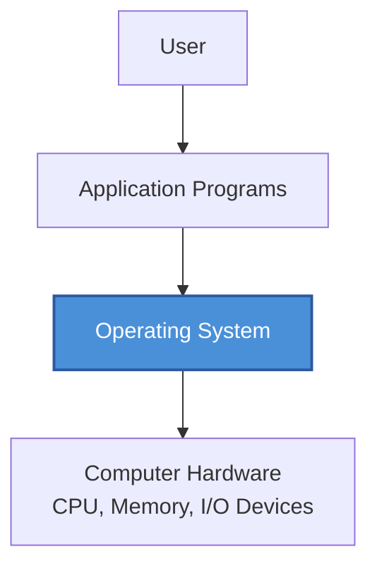
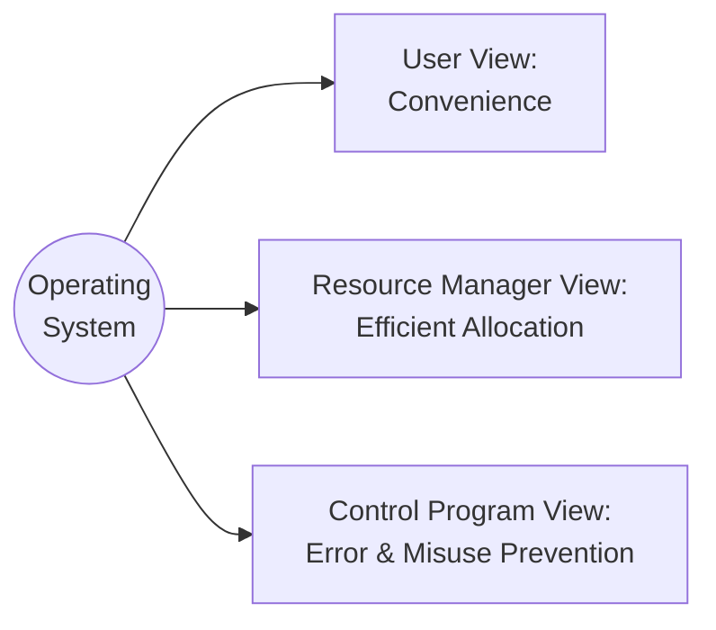
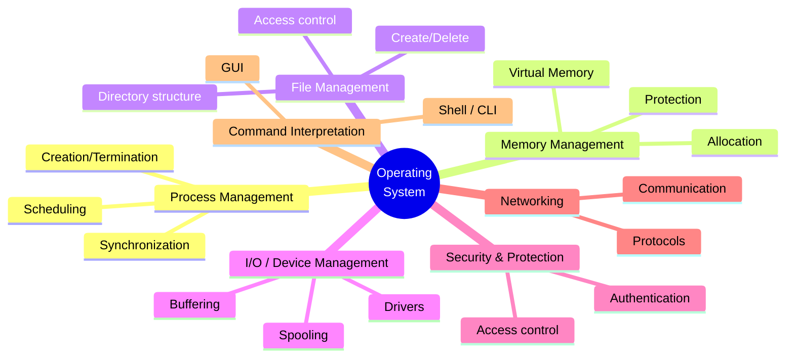
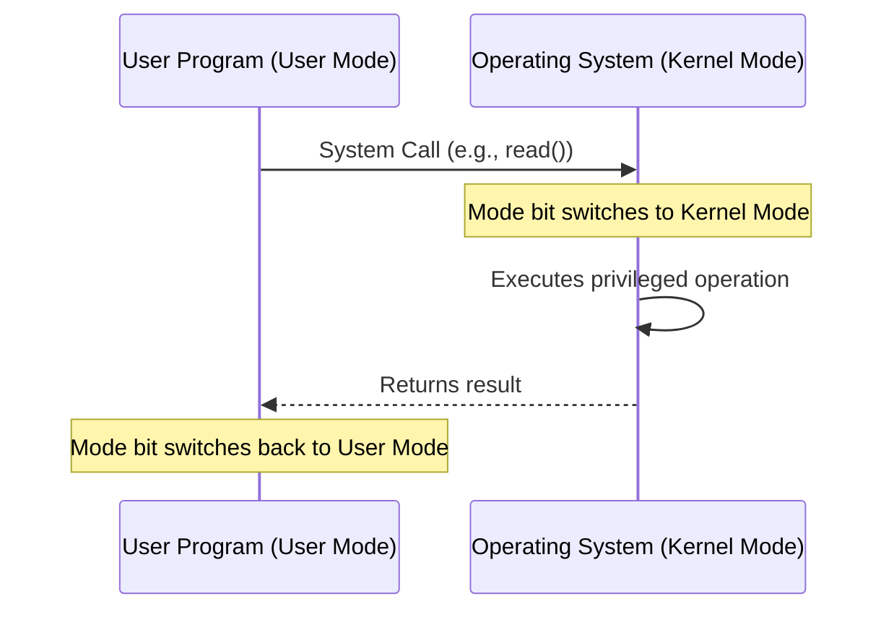
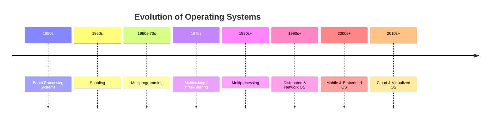

# Module 1 — Introduction to Operating Systems

[⬅ Back to Index](../README.md)

## 🎯 Learning Objectives
By the end of this module, students should be able to:
- Define an OS and explain it from 3 different "views"
- List and explain the goals and functions of an OS
- Distinguish between the major categories/types of operating systems
- Explain the OS structure, kernel architectures, and mode of execution (user/kernel mode)
- Describe how a computer boots and where the OS fits into that process
- Trace the historical evolution from batch systems to multiprocessing and beyond
- Solve GATE/exam-style conceptual questions built around these ideas

---

## 1.1 What is an Operating System?

> **Definition:** An Operating System (OS) is system software that acts as an **intermediary** between the user/application programs and the computer hardware. It manages hardware resources and provides a convenient, efficient, and secure environment for program execution.

In simpler words: a computer's hardware (CPU, memory, disks, keyboard, screen, network card) is "dumb" — it only understands raw electrical signals and machine instructions. Humans and application programs, on the other hand, want to work in terms of files, windows, programs, and commands. The OS is the translator and manager that sits between these two worlds.

**Teaching cue:** Draw this as a "sandwich" — hardware at the bottom, OS in the middle, applications/user on top. Emphasize: *the user never talks to hardware directly.*

### 1.1.1 Why do we even need an OS?
- **Abstraction:** Hides the messy details of hardware (disk sector numbers, interrupt lines, memory addresses) behind clean concepts (files, processes, virtual memory).
- **Resource sharing:** Multiple programs/users must share limited CPU, memory, and I/O devices fairly and safely.
- **Protection & isolation:** One buggy or malicious program should not be able to crash the whole system or read another program's data.
- **Standardized interface:** Application developers write code against OS-provided APIs (system calls) instead of hardware-specific instructions, making software portable.

### 1.1.2 The OS as a Resource Manager & Extended Machine
Two classic ways to think about what an OS *does*, beyond the three "views" below:
- **Top-down (Extended/Virtual Machine view):** The OS hides hardware complexity and gives programs a nicer, virtual version of the machine (e.g., virtual memory instead of raw physical RAM addresses).
- **Bottom-up (Resource Manager view):** The OS is an orderly, controlled allocator of CPU time, memory space, and I/O devices among many competing programs.

---

## 1.2 Three Views of an Operating System

| View | Perspective | Analogy |
|---|---|---|
| **User View** | OS = convenient interface, ease of use | A car's steering wheel — hides engine complexity |
| **System (Resource Manager) View** | OS = allocator of CPU, memory, I/O among competing processes | A traffic police officer directing vehicles at a junction |
| **System (Control Program) View** | OS = prevents errors and improper use of the computer | A security guard enforcing rules |

**Elaboration for each view:**

1. **User View** — Different systems emphasize this differently:
   - On a **PC/desktop**, the OS is optimized for usability and single-user convenience (GUIs, drag-and-drop) rather than heavy resource sharing.
   - On a **mainframe/server**, the OS is optimized for maximizing resource utilization since it serves many users/jobs simultaneously — usability of a single terminal matters less than throughput.
   - On **embedded devices** (microwave, car ECU, smart TV), there may be little to no direct "user view" at all — the OS runs invisibly.

2. **System / Resource Manager View** — The OS must decide, at every moment: *Which process gets the CPU next? How much memory does each process get? Which process's I/O request is served first?* This requires scheduling algorithms, memory allocation policies, and device queues (covered in later modules).

3. **Control Program View** — The OS prevents:
   - Improper use of I/O devices
   - One process from overwriting another process's memory
   - Programs from monopolizing the CPU indefinitely
   - Unauthorized access to files and system resources

---

## 1.3 Goals of an Operating System

1. **Convenience** — easy for the user to use the computer.
2. **Efficiency** — efficient use of hardware resources (maximize CPU utilization, minimize wasted memory/I/O time).
3. **Ability to Evolve** — new features can be added without disturbing existing services (modularity, layered/modular design).
4. **Throughput** *(often added as a 4th goal in many textbooks)* — maximize the number of jobs processed per unit time.
5. **Reliability & Fault Tolerance** — the system should behave predictably and recover gracefully from errors.
6. **Protection & Security** — safeguard data, processes, and resources from accidental or malicious interference.

> **Exam tip:** Different textbooks (Silberschatz vs. Godse) phrase these slightly differently, but "Convenience," "Efficiency," and "Ability to Evolve" are the three most commonly asked in GATE/university exams. Some papers also expect **Throughput**, **Reliability**, and **Protection** as separate goals — mention them if the question says "list all goals."

---

## 1.4 Functions of an Operating System

**Brief elaboration of each function (each becomes its own module later in the course):**

| Function | What it Means | Example OS Component |
|---|---|---|
| **Process Management** | Creating, scheduling, suspending, resuming, and terminating processes; handling inter-process communication and synchronization | Scheduler, PCB (Process Control Block) |
| **Memory Management** | Keeping track of which parts of memory are in use, allocating/deallocating memory to processes, implementing virtual memory | MMU (Memory Management Unit), page tables |
| **File Management** | Creating/deleting files & directories, mapping files onto secondary storage, providing access permissions | File system (NTFS, ext4, FAT32) |
| **I/O / Device Management** | Managing communication with I/O devices via device drivers, buffering, caching, and spooling | Device drivers, buffer/cache manager |
| **Security & Protection** | Ensuring only authorized users/processes access specific resources | Authentication modules, access control lists |
| **Networking** | Allowing the machine to communicate with other machines over a network (relevant for distributed OS) | TCP/IP stack, sockets |
| **Command Interpretation** | Accepting and executing user commands, either via CLI (shell) or GUI | Shell (bash, cmd.exe), desktop environment |

---

## 1.5 User Mode vs Kernel Mode (Dual-Mode Operation)

A critical concept often skipped in a quick read-through but *heavily tested*:

- **Kernel mode (supervisor/privileged mode):** The CPU can execute *any* instruction, including privileged ones (direct hardware access, I/O instructions, memory management instructions). The core of the OS runs here.
- **User mode:** Application programs run here with restricted privileges — they cannot directly execute privileged instructions or access hardware directly.

A **mode bit** in the CPU (0 = kernel, 1 = user, in most textbook conventions) tells the hardware which mode it is currently in. When a user program needs a privileged operation (e.g., reading a file from disk), it issues a **system call**, which causes a **trap** into kernel mode, the OS performs the operation, and control returns to user mode.

**GATE Trap ⚠️:** Dual-mode operation is what makes protection possible — without it, any user program could directly manipulate hardware and crash or compromise the whole system.

---

## 1.6 System Calls (Brief Preview)

A **system call** is the programmatic interface through which a user program requests a service from the OS kernel (e.g., `open()`, `read()`, `write()`, `fork()`, `exec()`). Broad categories:

- **Process control** — create/terminate process, load/execute, get/set process attributes
- **File management** — create/delete file, open/close, read/write
- **Device management** — request/release device, read/write device
- **Information maintenance** — get/set time, get system data
- **Communication** — send/receive messages, create/delete communication connection

*(A dedicated system-calls module will go deeper — this is just enough context for Module 1.)*

---

## 1.7 OS Structure / Kernel Architectures (Brief Preview)

| Architecture | Idea | Pros | Cons |
|---|---|---|---|
| **Monolithic Kernel** | Entire OS (process, memory, file, device management) runs as one large program in kernel mode | Fast (no inter-module message overhead) | Harder to maintain; a bug in one part can crash the whole OS |
| **Layered Approach** | OS divided into layers, each built on the one below it | Easier debugging & modularity | Careful layer ordering needed; some performance overhead |
| **Microkernel** | Only the bare essentials (IPC, basic scheduling, basic memory management) run in kernel mode; everything else runs as user-space services | More secure, more stable, easier to extend | Slower due to message-passing overhead between components |
| **Hybrid Kernel** | Combines monolithic speed with microkernel modularity (used by Windows NT, macOS/XNU) | Balance of speed & modularity | More complex design |

---

## 1.8 Types of Operating Systems

This section is often merged into "evolution" but deserves separate treatment for exams:

| Type | Description | Example |
|---|---|---|
| **Batch OS** | Jobs with similar needs grouped and run without user interaction | Early mainframe systems |
| **Multiprogrammed OS** | Multiple jobs kept in memory; CPU switches to another job during I/O wait, maximizing CPU utilization | Early time-sharing mainframes |
| **Time-Sharing (Multitasking) OS** | CPU rapidly switches between jobs on a time quantum, giving each user the illusion of exclusive access | UNIX, modern desktop OS |
| **Real-Time OS (RTOS)** | Guarantees a task completes within a strict deadline; classified as *Hard* (missing deadline = system failure, e.g., pacemaker) or *Soft* (missing deadline = degraded quality, e.g., video streaming) | VxWorks, FreeRTOS |
| **Distributed OS** | Manages a group of independent, networked computers and makes them appear as a single coherent system to the user | Amoeba, some cluster OS |
| **Network OS** | Provides services across a network but each machine retains its own local autonomy (unlike distributed OS) | Novell NetWare, Windows Server |
| **Mobile OS** | Optimized for battery life, touch input, and limited resources | Android, iOS |
| **Embedded OS** | Runs on dedicated-purpose hardware with tight resource constraints | Embedded Linux, RTOS variants in appliances |

**GATE Trap ⚠️:** Don't confuse *Distributed OS* (single system image across machines) with *Network OS* (each machine is independent, just cooperating over the network).

---

## 1.9 Booting: How Does the OS Start?

1. **Power-on** triggers the **BIOS/UEFI firmware** stored in ROM to run a **POST (Power-On Self-Test)**.
2. The firmware locates the **bootloader** (e.g., GRUB, Windows Boot Manager) on a storage device.
3. The bootloader loads the OS **kernel** into memory.
4. The kernel initializes device drivers, memory management, and process management, then starts the first user-space process (e.g., `init`/`systemd` on Linux).

This is why the OS is sometimes called "the first program to run" from the user's perspective — even though firmware technically runs before it.

---

## 1.10 Evolution of Operating Systems

**Teaching cue:** Present this as a *timeline story* — "Why did each generation exist? What problem did it solve?"

| Stage | Problem It Solved | Key Idea |
|---|---|---|
| **Batch Processing** | Manual job setup wasted CPU time | Group similar jobs into a batch, run without user interaction |
| **Spooling** (Simultaneous Peripheral Operations On-Line) | Slow I/O devices blocked the CPU | Use disk as a buffer between fast CPU and slow I/O device |
| **Multiprogramming** | CPU sat idle while one job waited for I/O | Keep multiple jobs in memory; switch to another job when one waits on I/O |
| **Multitasking (Time-Sharing)** | Users wanted interactive response, not just batch throughput | Rapid CPU switching (time slices) gives illusion of simultaneous execution |
| **Multiprocessing** | Single CPU is a throughput bottleneck | Multiple CPUs share memory & peripherals, executing in parallel |
| **Distributed Systems** | A single machine can't scale to serve large, geographically spread workloads | Multiple independent computers cooperate and appear as one system |
| **Virtualization / Cloud** | Physical hardware underutilized; inflexible provisioning | Hypervisors let multiple virtual machines/OS instances share one physical machine |

### Visual: Multiprogramming vs Multitasking

```mermaid
gantt
    dateFormat X
    axisFormat %s
    title Multiprogramming: CPU switches jobs only when one blocks on I/O
    section CPU
    Job A runs      :0, 3
    Job B runs (A waiting on I/O) :3, 6
    Job A resumes    :6, 8
```

**GATE Trap ⚠️:** Students often confuse *multiprogramming* (goal: maximize CPU utilization, switches on I/O wait) with *multitasking* (goal: fast response time, switches on time quantum expiry — even if a process is not I/O-blocked).

### 1.10.1 Multiprocessing: Symmetric vs Asymmetric
- **Symmetric Multiprocessing (SMP):** All CPUs are treated equally; each runs the same copy of the OS and can execute any process. Most modern multi-core systems use SMP.
- **Asymmetric Multiprocessing (AMP):** One "master" processor controls the system and assigns work to other "slave" processors, which only execute what they're told.

---

## 1.11 Virtualization (Bonus Concept for College-Level Depth)

Modern OS courses increasingly expect awareness of virtualization since it's foundational to cloud computing:

- A **hypervisor** (Type 1: bare-metal like VMware ESXi/Xen, or Type 2: hosted like VirtualBox/VMware Workstation) allows multiple **virtual machines (VMs)**, each running its own guest OS, to share one physical machine.
- This is conceptually an extension of the "Extended Machine" idea in 1.1.2 — the hypervisor gives each VM a *virtual* version of the hardware.
- **Containers** (Docker, etc.) are a lighter-weight alternative that virtualize at the OS level rather than the hardware level, sharing the host kernel.

---

## 📝 Solved Examples (Conceptual, GATE-style)

**Q1.** Which of the following best justifies the need for spooling?
A) To increase the number of CPUs
B) To allow simultaneous peripheral operations without blocking the CPU on slow I/O devices
C) To reduce memory size
D) To eliminate the need for an OS

**Answer: B** — Spooling decouples slow I/O device speed from CPU speed by using disk as an intermediate buffer, so the CPU is never forced to wait on a device like a printer.

**Q2.** A system switches the CPU to another process specifically to keep interactive response times low, even when the current process is not waiting on I/O. This behavior characterizes:
A) Multiprogramming
B) Batch Processing
C) Multitasking (Time-Sharing)
D) Spooling

**Answer: C** — The defining trait of multitasking/time-sharing is switching on a time quantum to preserve responsiveness, unlike multiprogramming which switches only on I/O waits.

**Q3.** Which mode must the CPU be in to execute a privileged instruction such as directly accessing an I/O port?
A) User mode
B) Kernel mode
C) Either mode
D) Sleep mode

**Answer: B** — Privileged instructions can only be executed in kernel (supervisor) mode; this restriction is what enforces protection between user programs and hardware.

---

## ✅ Common GATE / Exam Traps
- Confusing **multiprogramming** (CPU utilization focus) with **multitasking** (response time focus).
- Assuming spooling requires multiple CPUs — it doesn't; it's a buffering technique using disk.
- Thinking "OS view" questions only have one correct "view" — GATE sometimes tests all three views in the same question set.
- Confusing **Distributed OS** (single system image) with **Network OS** (independent machines cooperating).
- Forgetting that **dual-mode operation** (user/kernel mode) is the actual mechanism that enables the "Control Program" view of the OS — protection isn't just a policy, it's hardware-enforced.
- Mixing up **Symmetric** vs **Asymmetric** multiprocessing.

---

## 🔑 Quick Revision Summary
- **OS = intermediary** between user/applications and hardware.
- **3 views:** User (convenience), Resource Manager (allocation), Control Program (protection).
- **Goals:** Convenience, Efficiency, Ability to Evolve (+ Throughput, Reliability, Security).
- **Functions:** Process, Memory, File, I/O/Device management + Security, Networking, Command Interpretation.
- **Dual-mode operation** (user/kernel) is the hardware mechanism enabling protection.
- **Evolution:** Batch → Spooling → Multiprogramming → Multitasking → Multiprocessing → Distributed → Virtualized/Cloud.
- **Types:** Batch, Multiprogrammed, Time-Sharing, Real-Time (Hard/Soft), Distributed, Network, Mobile, Embedded.
- **Kernel architectures:** Monolithic, Layered, Microkernel, Hybrid.

---

[⬅ Back to Index](../README.md) | [Next: Process Management & CPU Scheduling ➡](../02-process-management-and-cpu-scheduling/README.md)
