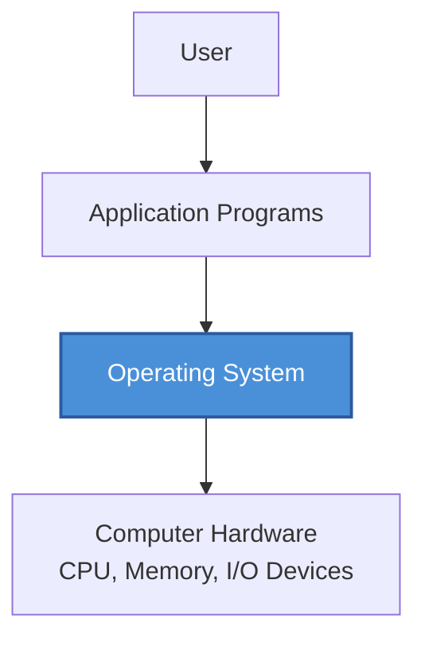
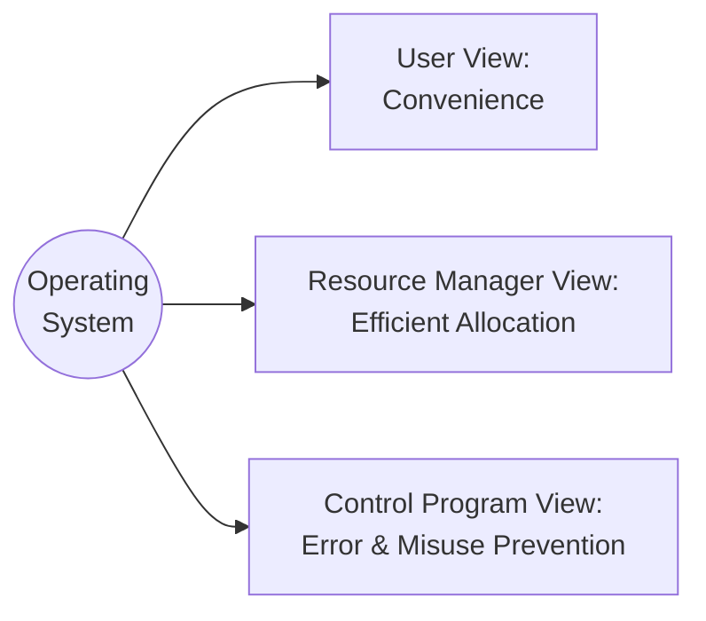
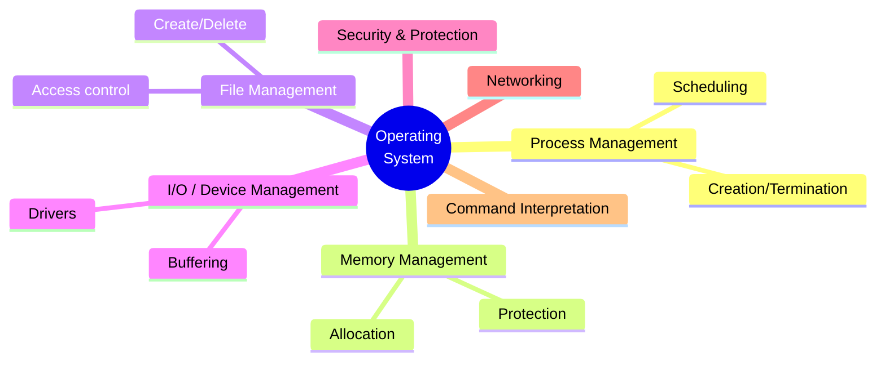
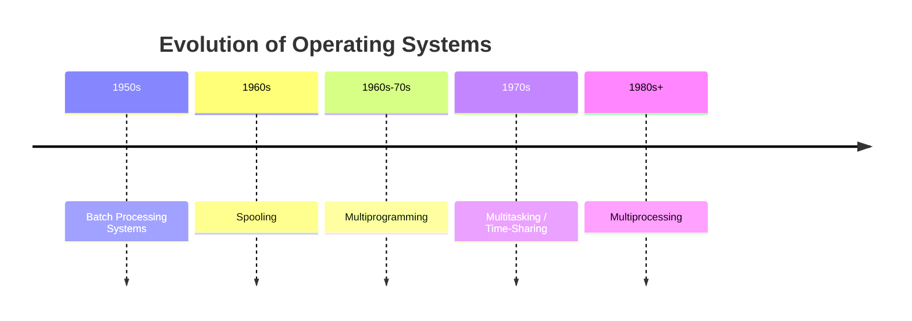

# Module 1 — Introduction to Operating Systems

[⬅ Back to Index](../README.md)

## 🎯 Learning Objectives
By the end of this module, students should be able to:
- Define an OS and explain it from 3 different "views"
- List the goals and functions of an OS
- Trace the historical evolution from batch systems to multiprocessing

---

## 1.1 What is an Operating System?

> **Definition:** An Operating System is system software that acts as an **intermediary** between the user/application programs and the computer hardware. It manages hardware resources and provides a convenient, efficient environment for program execution.

**Teaching cue:** Draw this as a "sandwich" — hardware at the bottom, OS in the middle, applications/user on top. Emphasize: *the user never talks to hardware directly.*

---

## 1.2 Three Views of an Operating System

| View | Perspective | Analogy |
|---|---|---|
| **User View** | OS = convenient interface, ease of use | A car's steering wheel — hides engine complexity |
| **System (Resource Manager) View** | OS = allocator of CPU, memory, I/O among competing processes | A traffic police officer directing vehicles at a junction |
| **System (Control Program) View** | OS = prevents errors and improper use of the computer | A security guard enforcing rules |

---

## 1.3 Goals of an Operating System

1. **Convenience** — easy for the user to use the computer.
2. **Efficiency** — efficient use of hardware resources.
3. **Ability to Evolve** — new features can be added without disturbing existing services.

## 1.4 Functions of an Operating System

---

## 1.5 Evolution of Operating Systems

**Teaching cue:** Present this as a *timeline story* — "Why did each generation exist? What problem did it solve?"

| Stage | Problem It Solved | Key Idea |
|---|---|---|
| **Batch Processing** | Manual job setup wasted CPU time | Group similar jobs into a batch, run without user interaction |
| **Spooling** (Simultaneous Peripheral Operations On-Line) | Slow I/O devices blocked the CPU | Use disk as a buffer between fast CPU and slow I/O device |
| **Multiprogramming** | CPU sat idle while one job waited for I/O | Keep multiple jobs in memory; switch to another job when one waits on I/O |
| **Multitasking (Time-Sharing)** | Users wanted interactive response, not just batch throughput | Rapid CPU switching (time slices) gives illusion of simultaneous execution |
| **Multiprocessing** | Single CPU is a throughput bottleneck | Multiple CPUs share memory & peripherals, executing in parallel |

### Visual: Multiprogramming vs Multitasking

```mermaid
gantt
    dateFormat X
    axisFormat %s
    title Multiprogramming: CPU switches jobs only when one blocks on I/O
    section CPU
    Job A runs      :0, 3
    Job B runs (A waiting on I/O) :3, 6
    Job A resumes    :6, 8
```

**GATE Trap ⚠️:** Students often confuse *multiprogramming* (goal: maximize CPU utilization, switches on I/O wait) with *multitasking* (goal: fast response time, switches on time quantum expiry — even if a process is not I/O-blocked).

---

## 📝 Solved Example (Conceptual, GATE-style)

**Q:** Which of the following best justifies the need for spooling?
A) To increase the number of CPUs
B) To allow simultaneous peripheral operations without blocking the CPU on slow I/O devices
C) To reduce memory size
D) To eliminate the need for an OS

**Answer: B** — Spooling decouples slow I/O device speed from CPU speed by using disk as an intermediate buffer, so the CPU is never forced to wait on a device like a printer.

---

## ✅ Common GATE Traps
- Confusing **multiprogramming** (CPU utilization focus) with **multitasking** (response time focus).
- Assuming spooling requires multiple CPUs — it doesn't; it's a buffering technique.
- Thinking "OS view" questions only have one correct "view" — GATE sometimes tests all three views in the same question set.

---

## 🧑‍🏫 Teaching Flow (45 min suggestion)
| Time | Activity |
|---|---|
| 0–10 min | Draw the "sandwich" diagram (§1.1); discuss real examples (Windows, Linux, Android) |
| 10–20 min | Three views (§1.2) — ask students to classify given scenarios into a view |
| 20–35 min | Evolution timeline (§1.5) — tell it as a story, draw the Gantt-style CPU timeline |
| 35–45 min | Quick MCQ round using the "Common GATE Traps" section |

[⬅ Back to Index](../README.md) | [Next: Process Management & CPU Scheduling ➡](../02-process-management-and-cpu-scheduling/README.md)
