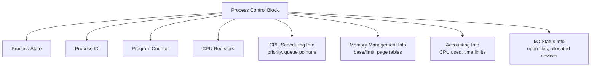
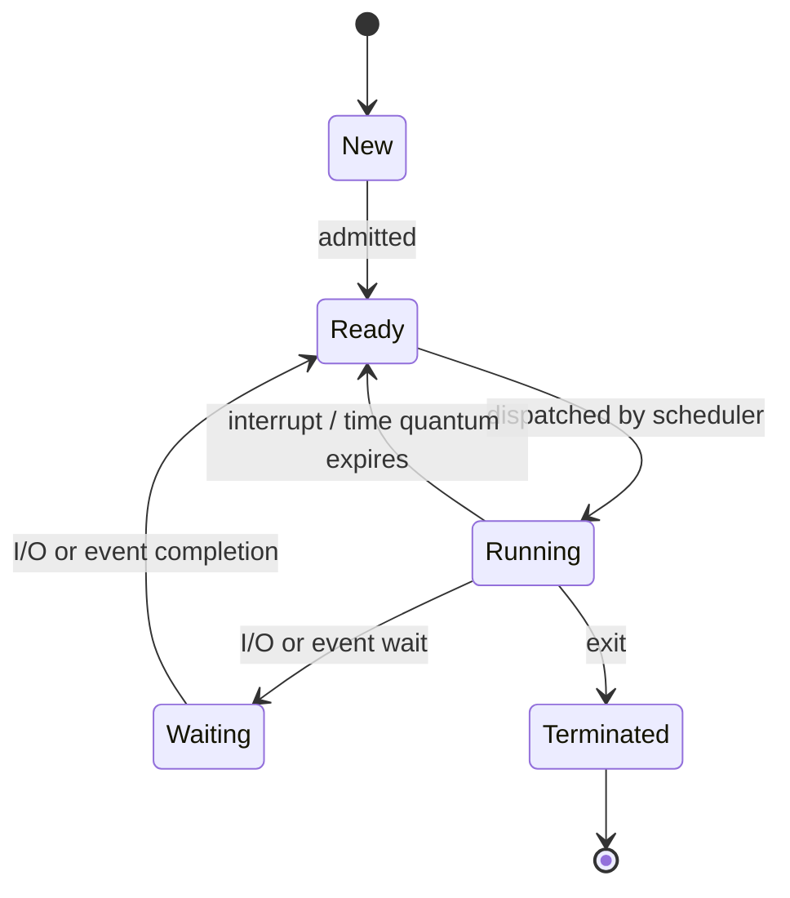

# Module 2 — Process Management & CPU Scheduling

[⬅ Back to Index](../README.md)

## 🎯 Learning Objectives
- Explain what a process is, its attributes, and its PCB
- Draw and explain the process state diagram
- Solve Gantt-chart numericals for FCFS, SJF, SRTF, Round Robin, and Priority Scheduling
- Compare scheduling algorithms on GATE-relevant criteria

⭐ **GATE Weightage:** Very High — 2-4 marks almost every year, usually as a numerical.

---

## 2.1 What is a Process?

> A **process** is a program in execution. A program is a *passive* entity (code on disk); a process is an *active* entity (code + current activity: PC, registers, stack).

**Teaching cue:** "A recipe (program) vs. someone actually cooking using the recipe right now (process)."

### Attributes of a Process
- Process ID (PID)
- Program Counter (PC)
- CPU Registers
- Memory limits (base/limit registers)
- List of open files
- Priority
- Current process state

### Process Control Block (PCB)



**Teaching cue:** PCB is the OS's "ID card + medical record" for a process — everything needed to pause it and resume it later exactly where it left off (this is the basis of **context switching**).

---

## 2.2 Process State Diagram



**GATE Trap ⚠️:** A process **cannot** go directly from `Waiting` to `Running`. It must always pass through `Ready` first — the scheduler must dispatch it.

---

## 2.3 CPU Scheduling — Why & Criteria

**Need for CPU Scheduling:** In multiprogramming, several processes reside in memory; the scheduler decides which one gets the CPU next to maximize utilization.

| Criterion | Formula / Meaning | Want to... |
|---|---|---|
| CPU Utilization | % of time CPU is busy | Maximize |
| Throughput | Processes completed per unit time | Maximize |
| **Turnaround Time (TAT)** | Completion Time − Arrival Time | Minimize |
| **Waiting Time (WT)** | Turnaround Time − Burst Time | Minimize |
| **Response Time (RT)** | Time of first CPU allocation − Arrival Time | Minimize |

> 🔑 **Memorize this chain:** `TAT = CT − AT`  and  `WT = TAT − BT`
> This single relationship solves 90% of GATE scheduling numericals once you have the Gantt chart.

---

## 2.4 Non-Preemptive & Basic Algorithms

### (a) FCFS — First Come First Serve
Processes executed strictly in arrival order. Simple, but causes the **Convoy Effect** (short jobs stuck behind a long one).

**Solved Example:**

| Process | Arrival Time | Burst Time |
|---|---|---|
| P1 | 0 | 5 |
| P2 | 1 | 3 |
| P3 | 2 | 8 |

```mermaid
gantt
    dateFormat X
    axisFormat %s
    title FCFS Gantt Chart
    section CPU
    P1 : 0, 5
    P2 : 5, 8
    P3 : 8, 16
```



| Process | CT | TAT (CT−AT) | WT (TAT−BT) |
|---|---|---|---|
| P1 | 5 | 5 | 0 |
| P2 | 8 | 7 | 4 |
| P3 | 16 | 14 | 6 |

**Average WT = (0+4+6)/3 = 3.33**, **Average TAT = (5+7+14)/3 = 8.67**

---

### (b) SJF — Shortest Job First (Non-preemptive)
Picks the waiting process with the **smallest burst time**. Minimizes average waiting time among non-preemptive algorithms, but can **starve** long processes.

### (c) SJF with Predicted Burst Time (Exponential Averaging)
Since future burst time is unknown, it's *predicted*:

```
τ(n+1) = α·t(n) + (1−α)·τ(n)
```
- `t(n)` = actual burst time of nth CPU burst
- `τ(n)` = predicted value for nth burst
- `α` (0 ≤ α ≤ 1) = weight given to recent history (α=1 → only most recent burst matters; α=0 → history ignored, prediction never changes)

### (d) SRTF — Shortest Remaining Time First (Preemptive SJF)
If a new process arrives with a burst time shorter than the **remaining** time of the currently running process, preempt.

**Solved Example (SRTF):**

| Process | AT | BT |
|---|---|---|
| P1 | 0 | 8 |
| P2 | 1 | 4 |
| P3 | 2 | 9 |
| P4 | 3 | 5 |

```mermaid
gantt
    dateFormat X
    axisFormat %s
    title SRTF Gantt Chart
    section CPU
    P1 (0-1) : 0, 1
    P2 (1-5) : 1, 5
    P4 (5-10): 5, 10
    P1 (10-17): 10, 17
    P3 (17-26): 17, 26
```


*(P1 runs 1 unit, then P2 arrives with BT=4 < P1's remaining 7 → preempt. At t=5, P4 arrives BT=5 < P1's remaining 7 → preempt again. P1 finally resumes at t=10 with 7 units remaining.)*

---

### (e) Round Robin (RR)
Each process gets a fixed **time quantum**; if not finished, it goes to the back of the ready queue.

- **Time quantum too small** → excessive context-switch overhead (behaves inefficiently)
- **Time quantum too large** → degenerates into FCFS

**Rule of thumb (GATE):** 80% of CPU bursts should be shorter than the time quantum for RR to work well.

**Solved Example:** AT=0 for all; BT: P1=5, P2=3, P3=8; Quantum = 4

```mermaid
gantt
    dateFormat X
    axisFormat %s
    title Round Robin (Quantum = 4) Gantt Chart
    section CPU
    P1 : 0, 4
    P2 : 4, 7
    P3 : 7, 11
    P1 : 11, 12
    P3 : 12, 16
```



---

## 2.5 Advanced Algorithms

| Algorithm | Idea | GATE Note |
|---|---|---|
| **LJF** (Longest Job First) | Opposite of SJF — picks the longest burst | Causes starvation of short jobs; rarely tested numerically |
| **LRTF** (Longest Remaining Time First) | Preemptive LJF | Same starvation issue |
| **HRRN** (Highest Response Ratio Next) | Non-preemptive; picks highest `(WT+BT)/BT` | Prevents starvation seen in SJF — **favorite GATE numerical** |
| **Priority Scheduling** | Runs highest-priority process first | Starvation solved via **Aging** (gradually increase priority of waiting processes) |
| **Multilevel Queue** | Ready queue split into multiple queues (e.g., foreground/background), each with fixed priority | No movement between queues |
| **Multilevel Feedback Queue (MLFQ)** | Like multilevel queue, but processes **can move** between queues based on behavior | Most flexible/realistic; used in real OS schedulers |

**HRRN Solved Example:**

At a decision point, WT=6, BT=3 for a process →
`Response Ratio = (6+3)/3 = 3`

Compare response ratios of all waiting processes; **highest wins**.

---

## 2.6 Comparative Summary Table

| Algorithm | Preemptive? | Starvation Risk | Best For |
|---|---|---|---|
| FCFS | No | No (but convoy effect) | Simple batch systems |
| SJF | No | Yes (long jobs) | Minimizing avg waiting time |
| SRTF | Yes | Yes (long jobs) | Preemptive minimization of WT |
| Round Robin | Yes | No | Time-sharing / interactive systems |
| Priority | Either | Yes (low priority) | Real-time / importance-based systems |
| HRRN | No | No | Balances short & long jobs fairly |
| MLFQ | Yes | Minimal (with aging) | General-purpose modern OS |

---

## ✅ Common GATE Traps
- Forgetting that in **SRTF**, ties are usually broken by arrival time (check the question's convention).
- Computing **average waiting time** using wrong formula — always derive from the Gantt chart, don't memorize shortcuts blindly.
- In **Round Robin**, forgetting to add a process **back into the queue** if it arrives at the exact same time another process is preempted (order matters!).
- Assuming Priority Scheduling is always preemptive — GATE explicitly states which variant.

---

## 🧑‍🏫 Teaching Flow (60 min suggestion)
| Time | Activity |
|---|---|
| 0–10 min | Process concept + PCB diagram + state diagram (draw state diagram live, ask "can Waiting go to Running directly?") |
| 10–15 min | Scheduling criteria + the `TAT = CT-AT`, `WT = TAT-BT` chain (write on board, don't skip this) |
| 15–35 min | Work through FCFS → SJF → SRTF → RR live on the board using the same process set so students see the *contrast* |
| 35–45 min | HRRN & Priority + aging discussion |
| 45–60 min | Group exercise: give a process table, have students draw the Gantt chart for 2 algorithms and compute avg WT/TAT |

[⬅ Previous: Introduction to OS](../01-introduction-to-os/README.md) | [⬆ Index](../README.md) | [Next: Process Synchronization ➡](../03-process-synchronization/README.md)
