```mermaid
gantt
    dateFormat X
    axisFormat %s
    title SRTF Gantt Chart
    section CPU
    P1 (0-1) : 0, 1
    P2 (1-5) : 1, 5
    P4 (5-10): 5, 10
    P1 (10-17): 10, 17
    P3 (17-26): 17, 26
```

```mermaid
gantt
    dateFormat X
    axisFormat %s
    title Round Robin (Quantum = 4) Gantt Chart
    section CPU
    P1 : 0, 4
    P2 : 4, 7
    P3 : 7, 11
    P1 : 11, 12
    P3 : 12, 16
```

# CPU Scheduling — Algorithm-by-Algorithm Explanation with Examples & GATE Questions

[⬅ Back to Module 2](./Module2-Process-Management-and-CPU-Scheduling.md)

This document walks through **every major CPU scheduling algorithm** one at a time: how it works, a fully worked numerical example (with Gantt chart + TAT/WT table), and a GATE-style practice question (with solution) for each.

> 🔑 Recall the master formulas used throughout:
> `TAT = Completion Time (CT) − Arrival Time (AT)`
> `WT = TAT − Burst Time (BT)`
> `Response Time (RT) = Time of first CPU allocation − AT`

---

## 1. FCFS — First Come First Serve

**How it works:** Processes are served strictly in the order they arrive in the ready queue, like a single line at a billing counter. Non-preemptive — once a process starts, it runs to completion.

**Key weakness — Convoy Effect:** If a long process arrives first, all shorter processes behind it must wait, even though serving them first would reduce average waiting time.

### Worked Example
| Process | AT | BT |
|---|---|---|
| P1 | 0 | 5 |
| P2 | 1 | 3 |
| P3 | 2 | 8 |

```mermaid
gantt
    dateFormat X
    axisFormat %s
    title FCFS Gantt Chart
    section CPU
    P1 : 0, 5
    P2 : 5, 8
    P3 : 8, 16
```



| Process | CT | TAT | WT |
|---|---|---|---|
| P1 | 5 | 5 | 0 |
| P2 | 8 | 7 | 4 |
| P3 | 16 | 14 | 6 |

**Avg WT = 3.33, Avg TAT = 8.67**

### 🎯 GATE-style Question
Three processes P1, P2, P3 arrive at times 0, 2, 4 with burst times 6, 2, 4 respectively, scheduled by FCFS. What is the waiting time of P3?

**Solution:**
- P1 runs 0→6 (CT=6)
- P2 waits until P1 finishes: runs 6→8 (CT=8)
- P3 waits until P2 finishes: runs 8→12 (CT=12)
- P3: TAT = 12−4 = 8, WT = 8−4 = **4**

---

## 2. SJF (Non-Preemptive) — Shortest Job First

**How it works:** At every scheduling decision point (i.e., whenever the CPU is free), the OS picks the **waiting** process with the smallest burst time and runs it to completion without interruption.

**Why it matters:** Among all *non-preemptive* algorithms, SJF gives the **minimum possible average waiting time** — this is a well-known theoretical result and a favorite GATE fact.

**Key weakness:** Can starve long processes if short processes keep arriving.

### Worked Example
| Process | AT | BT |
|---|---|---|
| P1 | 0 | 7 |
| P2 | 2 | 4 |
| P3 | 4 | 1 |
| P4 | 5 | 4 |

```mermaid
gantt
    dateFormat X
    axisFormat %s
    title SJF (Non-Preemptive) Gantt Chart
    section CPU
    P1 : 0, 7
    P3 : 7, 8
    P2 : 8, 12
    P4 : 12, 16
```


*(At t=7 when P1 finishes, P2 (BT=4), P3 (BT=1), and P4 hasn't arrived yet but P3 has the shortest burst among those present → P3 runs next, then P2, then P4.)*

| Process | CT | TAT | WT |
|---|---|---|---|
| P1 | 7 | 7 | 0 |
| P2 | 12 | 10 | 6 |
| P3 | 8 | 4 | 3 |
| P4 | 16 | 11 | 7 |

**Avg WT = (0+6+3+7)/4 = 4**

### 🎯 GATE-style Question
Which scheduling algorithm minimizes the average waiting time for a given set of processes, assuming all processes are available at time 0 and no preemption is allowed?

**Solution:** **Shortest Job First (SJF), non-preemptive.** This is a direct theoretical result: sorting by increasing burst time minimizes the sum (and hence average) of waiting times when all jobs arrive together — analogous to the classic "scheduling to minimize total completion time" proof by exchange argument.

---

## 3. SJF with Predicted Burst Time (Exponential Averaging)

**How it works:** Real systems don't know a process's *next* CPU burst length in advance, so they **predict** it using exponentially weighted averaging of past bursts:

```
τ(n+1) = α·t(n) + (1−α)·τ(n)
```
- `t(n)` = actual length of the nth CPU burst (just observed)
- `τ(n)` = predicted length of the nth burst
- `α` (0 ≤ α ≤ 1) = how much weight is given to the most recent burst vs. history

**Interpretation:**
- `α = 1` → prediction = most recent burst only (ignores all older history)
- `α = 0` → prediction never changes from the initial guess (ignores all actual measurements)

### Worked Example
Let `α = 0.5`, initial guess `τ(1) = 10`, and actual bursts observed: `t(1)=6, t(2)=4, t(3)=8`

- `τ(2) = 0.5(6) + 0.5(10) = 8`
- `τ(3) = 0.5(4) + 0.5(8) = 6`
- `τ(4) = 0.5(8) + 0.5(6) = 7`

### 🎯 GATE-style Question
If α = 1 in the exponential averaging formula for CPU burst prediction, what does τ(n+1) equal?

**Solution:** Substituting α=1: `τ(n+1) = 1·t(n) + 0·τ(n) = t(n)`. So the predicted next burst is simply **equal to the actual most recently observed burst** — history is completely ignored. **Answer: τ(n+1) = t(n)**

---

## 4. SRTF — Shortest Remaining Time First (Preemptive SJF)

**How it works:** The preemptive version of SJF. Whenever a new process arrives, the scheduler compares its burst time to the **remaining** burst time of the currently running process. If the new arrival's burst time is smaller, the running process is preempted immediately.

### Worked Example
| Process | AT | BT |
|---|---|---|
| P1 | 0 | 8 |
| P2 | 1 | 4 |
| P3 | 2 | 9 |
| P4 | 3 | 5 |



**Step-by-step reasoning:**
- t=0: only P1 (rem=8) present → runs.
- t=1: P2 arrives (BT=4). P1's remaining = 7. Since 4 < 7 → **preempt**, P2 runs.
- t=2: P3 arrives (BT=9). P2's remaining = 3 (4−1 already run). 9 > 3 → no preemption.
- t=3: P4 arrives (BT=5). P2's remaining = 2. 5 > 2 → no preemption.
- t=5: P2 finishes. Compare remaining times: P1=7, P3=9, P4=5 → **P4** (smallest) runs next.
- t=10: P4 finishes. Compare: P1=7, P3=9 → **P1** runs (finishes at 17).
- t=17: only P3 left → runs to completion at 26.

### 🎯 GATE-style Question
In SRTF scheduling, a running process is preempted when:
A) Its time quantum expires
B) A higher-priority process arrives
C) A newly arrived process has a burst time less than the *remaining* burst time of the running process
D) The running process requests I/O

**Solution: (C)** — SRTF preemption is triggered purely by comparing the new arrival's total burst time against the *currently running* process's **remaining** (not total) burst time.

---

## 5. Round Robin (RR)

**How it works:** Designed for time-sharing systems. Each process gets a fixed **time quantum (TQ)**. If it doesn't finish within that quantum, it's preempted and placed at the **back of the ready queue**, and the next process in the queue gets the CPU.

**Effect of time quantum size:**
- **Too small** → too many context switches → high overhead → poor CPU utilization
- **Too large** → behaves like FCFS → poor response time

**Rule of thumb (GATE fact):** A good time quantum should be large enough that ~80% of CPU bursts complete within one quantum.

### Worked Example
AT=0 for all; BT: P1=5, P2=3, P3=8; Quantum = 4



**Step-by-step:**
- Queue: [P1, P2, P3]. P1 runs 0→4 (1 unit remaining), goes to back → Queue: [P2, P3, P1]
- P2 runs 4→7 (finishes, BT=3 < TQ=4) → Queue: [P3, P1]
- P3 runs 7→11 (4 units remaining), goes to back → Queue: [P1, P3]
- P1 runs 11→12 (finishes, 1 unit left) → Queue: [P3]
- P3 runs 12→16 (finishes)

| Process | CT | TAT | WT |
|---|---|---|---|
| P1 | 12 | 12 | 7 |
| P2 | 7 | 7 | 4 |
| P3 | 16 | 16 | 8 |

### 🎯 GATE-style Question
For Round Robin scheduling with a very large time quantum (larger than the longest burst time), the algorithm behaves equivalent to:

**Solution:** **FCFS.** If the time quantum exceeds every process's burst time, no process is ever preempted mid-burst, so each process runs to completion in arrival-queue order — identical behavior to FCFS.

---

## 6. LJF / LRTF — Longest Job First / Longest Remaining Time First

**How it works:** The mirror image of SJF/SRTF — always pick the process with the **largest** burst time (LJF, non-preemptive) or largest **remaining** time (LRTF, preemptive).

**Why it's rarely used in practice:** It's essentially the *worst-case* strategy for waiting time — short jobs get starved behind long ones. It's mostly tested **conceptually** in GATE (rarely as a full numerical), to test whether students understand it's the *opposite* of SJF/SRTF.

### 🎯 GATE-style Question
Which of the following scheduling policies is most likely to cause starvation of short processes?
A) SJF  B) Round Robin  C) LJF  D) FCFS

**Solution: (C) LJF** — By definition it always favors the longest job, so short jobs sitting in the ready queue may never get scheduled while long jobs keep arriving.

---

## 7. Priority Scheduling

**How it works:** Each process is assigned a priority number; the CPU is always given to the process with the **highest priority** (note: by convention, in many textbooks a **lower number = higher priority**, but GATE questions always specify their own convention — read carefully!). Can be **preemptive** (a newly arrived higher-priority process interrupts the running one) or **non-preemptive** (current process finishes its burst first).

**Key weakness — Starvation:** A low-priority process might wait indefinitely if higher-priority processes keep arriving.

**Solution — Aging:** Gradually increase the priority of a process the longer it waits, guaranteeing it eventually becomes the highest priority.

### Worked Example (Non-preemptive, lower number = higher priority)
| Process | AT | BT | Priority |
|---|---|---|---|
| P1 | 0 | 4 | 2 |
| P2 | 0 | 3 | 1 |
| P3 | 0 | 1 | 3 |

```mermaid
gantt
    dateFormat X
    axisFormat %s
    title Priority Scheduling Gantt Chart
    section CPU
    P2 (priority 1) : 0, 3
    P1 (priority 2) : 3, 7
    P3 (priority 3) : 7, 8
```



| Process | CT | TAT | WT |
|---|---|---|---|
| P2 | 3 | 3 | 0 |
| P1 | 7 | 7 | 3 |
| P3 | 8 | 8 | 7 |

### 🎯 GATE-style Question
Which technique is used to prevent starvation in priority scheduling?

**Solution:** **Aging** — the OS periodically increases the priority of processes that have been waiting in the ready queue for a long time, ensuring every process eventually reaches the highest priority and gets scheduled.

---

## 8. HRRN — Highest Response Ratio Next

**How it works:** A **non-preemptive** algorithm designed to fix SJF's starvation problem. At each decision point, compute the **Response Ratio** for every waiting process and pick the highest:

```
Response Ratio = (Waiting Time + Burst Time) / Burst Time
```

As a process waits longer, its response ratio increases — even a long process eventually "wins" once it has waited long enough. This makes HRRN a **favorite GATE numerical topic** because it elegantly balances fairness (like aging) with efficiency (like SJF).

### Worked Example
| Process | AT | BT |
|---|---|---|
| P1 | 0 | 3 |
| P2 | 1 | 6 |
| P3 | 2 | 4 |
| P4 | 3 | 5 |

- t=0: only P1 present → runs 0→3.
- t=3 (decision point): candidates are P2 (AT=1, WT=3−1=2, BT=6), P3 (AT=2, WT=1, BT=4), P4 (AT=3, WT=0, BT=5)
  - RR(P2) = (2+6)/6 = 1.33
  - RR(P3) = (1+4)/4 = 1.25
  - RR(P4) = (0+5)/5 = 1.00
  - **P2 wins** (highest ratio) → runs 3→9
- t=9: candidates P3 (AT=2, WT=9−2=7, BT=4), P4 (AT=3, WT=6, BT=5)
  - RR(P3) = (7+4)/4 = 2.75
  - RR(P4) = (6+5)/5 = 2.2
  - **P3 wins** → runs 9→13
- t=13: only P4 left → runs 13→18

### 🎯 GATE-style Question
A process has been waiting for 6 units with a burst time of 3 units. What is its response ratio, and what does a response ratio of 1 signify?

**Solution:**
`Response Ratio = (6+3)/3 = 3`
A response ratio of exactly **1** means the process has just arrived and has *not waited at all* (since WT=0 gives (0+BT)/BT = 1) — this is the **minimum possible value** of the response ratio, confirming that HRRN never disadvantages a freshly arrived process below "neutral" priority.

---

## 9. Multilevel Queue (MLQ) Scheduling

**How it works:** The ready queue is partitioned into **several separate queues** based on process type or priority class (e.g., "system processes," "interactive processes," "batch processes"). Each queue can have its **own scheduling algorithm**, and the queues themselves are scheduled relative to each other (commonly with fixed priority between queues, or time-sliced between queues).

**Key restriction:** A process is permanently assigned to one queue based on some property (e.g., process type) and **does not move** between queues.

### 🎯 GATE-style Question
In Multilevel Queue scheduling, if fixed-priority scheduling is used between queues, what problem can arise?

**Solution:** **Starvation of lower-priority queues** — if the higher-priority queue (e.g., system processes) always has processes ready to run, the lower-priority queue (e.g., batch processes) may never get any CPU time at all, since queues are strictly prioritized.

---

## 10. Multilevel Feedback Queue (MLFQ) Scheduling

**How it works:** The most flexible and realistic scheduler, used (in modified forms) by many real operating systems. Like MLQ, it has multiple queues — but crucially, processes **can move between queues** based on their observed behavior:
- A process that uses too much CPU time (CPU-bound) gets **demoted** to a lower-priority queue.
- A process that waits a lot for I/O (I/O-bound, interactive) is **kept at or promoted to** a higher-priority queue for better responsiveness.

This makes MLFQ **self-tuning**: it doesn't need to know process behavior in advance (unlike SJF, which needs burst time knowledge) — it *learns* behavior from history, similar in spirit to the exponential-averaging burst prediction from Section 3.

**MLFQ is defined by:**
1. Number of queues
2. Scheduling algorithm within each queue
3. Method to decide when to **upgrade** a process to a higher queue
4. Method to decide when to **demote** a process to a lower queue
5. Method to decide which queue a process enters when it needs service

### 🎯 GATE-style Question
Which scheduling algorithm allows a process to move between different priority queues based on its CPU burst behavior, and is generally considered the most general/configurable scheduling algorithm?

**Solution:** **Multilevel Feedback Queue (MLFQ) scheduling.** Unlike ordinary Multilevel Queue scheduling (fixed queue assignment), MLFQ allows dynamic movement between queues, and by tuning its five defining parameters it can be configured to *simulate* FCFS, RR, or priority scheduling — making it the most general scheduling algorithm covered in this module.

---

## 📊 Quick-Reference Comparison

| Algorithm | Preemptive? | Starvation Risk | Needs Burst-Time Knowledge? | Best For |
|---|---|---|---|---|
| FCFS | No | No (convoy effect instead) | No | Simple batch systems |
| SJF (non-preemptive) | No | Yes (long jobs) | Yes | Minimizing avg WT, known burst times |
| SRTF | Yes | Yes (long jobs) | Yes | Preemptive minimization of WT |
| Round Robin | Yes | No | No | Time-sharing / interactive systems |
| LJF / LRTF | Either | Yes (short jobs) | Yes | Rarely used in practice |
| Priority | Either | Yes (low priority) | No (needs priority value) | Importance/real-time-based systems |
| HRRN | No | No | Yes | Fair balance of short & long jobs |
| Multilevel Queue | Yes (between/within queues) | Yes (lower queues) | No | Systems with clearly separable process classes |
| MLFQ | Yes | Minimal (self-adjusting) | No (learns dynamically) | General-purpose modern OS |

---

## ✅ Exam Traps to Remember Across All Algorithms
- Always double-check whether the question specifies **preemptive or non-preemptive** priority/SJF — the numerical answer changes completely.
- In **SRTF**, compare against the running process's **remaining** time, not its original burst time.
- In **Round Robin**, if a process is preempted at the same instant a new process arrives, follow the convention given in the question for queue insertion order (usually: newly arrived process is enqueued before the preempted one).
- **HRRN** always has response ratio ≥ 1; use this to sanity-check your calculations.
- **Aging** is the standard fix for starvation in priority scheduling; **MLFQ** is the general real-world answer that avoids most starvation issues by design.

[⬅ Back to Module 2](./Module2-Process-Management-and-CPU-Scheduling.md)
