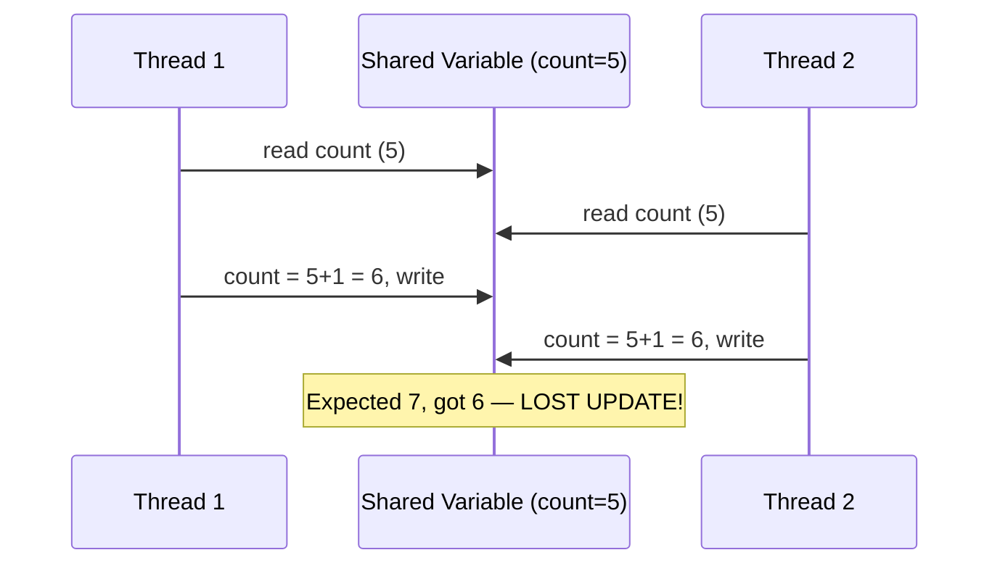
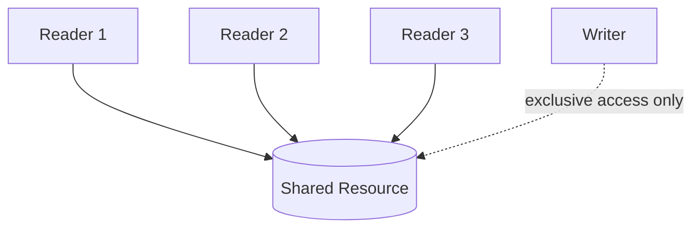
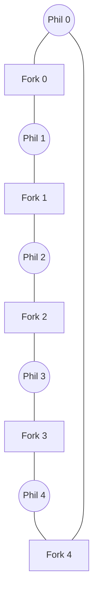

# Module 3 — Process Synchronization

[⬅ Back to Index](../README.md)

## 🎯 Learning Objectives
- Explain race conditions and the critical section problem
- State and apply the 3 criteria for a correct CS solution
- Trace Peterson's Algorithm and semaphore-based solutions
- Solve Producer-Consumer, Readers-Writers, Dining Philosophers conceptually

⭐ **GATE Weightage:** Very High — semaphore/mutex trace questions appear almost every year.

---

## 3.1 Race Condition & Critical Section

> **Race Condition:** The outcome of concurrent execution depends on the particular (unpredictable) order/timing in which shared data is accessed.

**Classic Teaching Example — Two threads incrementing a shared counter:**



**Critical Section (CS):** The segment of code where a process accesses shared resources, which must not be executed by more than one process at a time.


---

## 3.2 Criteria for a Correct CS Solution

| Criterion | Meaning |
|---|---|
| **1. Mutual Exclusion** | Only one process may be in its CS at a time |
| **2. Progress** | If no process is in CS, only processes *wanting* to enter CS decide who goes next — decision cannot be postponed indefinitely |
| **3. Bounded Waiting** | There's a limit on how many times other processes enter CS before a waiting process gets its turn (no indefinite postponement) |
| **4. Architectural Neutrality** | Solution must not assume anything about relative CPU speeds or number of CPUs |

**Teaching cue:** Use a **single-lane bridge** analogy — Mutual Exclusion = only one car on the bridge; Progress = if the bridge is empty, someone waiting *will* be let through (no deadlock in the decision itself); Bounded Waiting = no car waits forever while others keep cutting in line.

---

## 3.3 Software & Hardware Mechanisms

### Lock Variable (naive, broken)
```
while (lock == 1);   // busy wait
lock = 1;
// critical section
lock = 0;
```
❌ **Broken** — the check (`while`) and the set (`lock=1`) are not atomic → still a race condition.

### Strict Alternation (Turn Variable)
```
// Process 0                  // Process 1
while (turn != 0);            while (turn != 1);
CS;                            CS;
turn = 1;                      turn = 0;
```
✅ Mutual Exclusion — ❌ **Violates Progress** (P0 can't enter CS twice in a row even if P1 doesn't want to — forces strict turn-taking, causing busy-waiting even when the other doesn't want CS).

### Peterson's Algorithm (2-process, software-only)
```
flag[i] = true;
turn = j;
while (flag[j] && turn == j);   // wait
CS;
flag[i] = false;
```
✅ Satisfies Mutual Exclusion, Progress, AND Bounded Waiting for **2 processes**. Classic GATE trace question — **memorize this code**.

### Hardware: Test-and-Set Lock (TSL)
An **atomic** hardware instruction:
```
boolean TestAndSet(boolean *target) {
    boolean rv = *target;
    *target = true;
    return rv;    // atomic — no interrupt can split this
}
```
```
while (TestAndSet(&lock));   // acquire
CS;
lock = false;                // release
```
✅ Guarantees mutual exclusion via atomic hardware support — works for any number of processes.

### Disable Interrupts
Prevents context switch during CS by disabling interrupts.
⚠️ Only works on **uniprocessor** systems; disabling interrupts on all CPUs in a multiprocessor system is expensive and impractical.

---

## 3.4 Semaphores

> A **semaphore** `S` is an integer variable accessed only through two atomic operations:
> - `wait(S)` (a.k.a. `P()`): `while (S <= 0); S--;`
> - `signal(S)` (a.k.a. `V()`): `S++;`

| Type | Range | Use |
|---|---|---|
| **Counting Semaphore** | Any integer ≥ 0 | Control access to a resource with multiple instances |
| **Binary Semaphore (Mutex)** | 0 or 1 | Mutual exclusion (lock/unlock) |

**Sleep & Wakeup** — instead of busy-waiting, a blocked process is put to **sleep**; when the resource is free, it's **woken up**.

**Lost Wakeup Problem:** If a `wakeup` signal is sent *before* the process actually goes to sleep, the signal is lost and the process sleeps forever. Semaphores solve this by making the "check + sleep" atomic.

---

## 3.5 Producer–Consumer Problem (Semaphore Solution)


```
semaphore mutex = 1;      // mutual exclusion on buffer
semaphore empty = N;      // count of empty slots
semaphore full = 0;       // count of full slots

Producer:                          Consumer:
wait(empty);                       wait(full);
wait(mutex);                       wait(mutex);
  add item to buffer;                remove item from buffer;
signal(mutex);                     signal(mutex);
signal(full);                      signal(empty);
```

**GATE Trap ⚠️:** The order `wait(empty)` → `wait(mutex)` (not the reverse!) is critical — reversing them can cause **deadlock** (holding mutex while waiting for a full/empty slot that will never come because no one else can access the buffer to change it).

---

## 3.6 Readers–Writers Problem

- Multiple **readers** can read the shared resource simultaneously.
- A **writer** needs **exclusive** access (no readers or other writers).
- Variants: **Reader-priority** (writers may starve) vs **Writer-priority** (readers may starve).



---

## 3.7 Dining Philosophers Problem

5 philosophers sit at a round table with 5 forks (one between each pair). Each needs **both** adjacent forks to eat.



**The Problem:** If all 5 pick up their **left** fork simultaneously, none can get their right fork → **deadlock** (this is the classic bridge example to Module 4).

**Standard Solutions:**
1. Allow at most **4 philosophers** to sit at the table simultaneously.
2. Pick up forks only if **both** are available (atomic check).
3. **Asymmetric solution** — odd philosophers pick left-then-right, even philosophers pick right-then-left (breaks circular wait).
4. Use a **waiter/arbitrator** semaphore controlling access.

---

## 3.8 Monitors & Mutexes

> A **Monitor** is a high-level synchronization construct — a module bundling shared data with the procedures that operate on it, guaranteeing that **only one process** can be active inside the monitor at any time (mutual exclusion is built-in, unlike raw semaphores).

- **Condition Variables** inside a monitor: `wait()` (block until signaled), `signal()` (wake a waiting process).
- **Mutex vs Semaphore:** A mutex is a simple binary lock (owned by whoever locked it, must be unlocked by the same thread). A semaphore is a more general counter, not necessarily "owned."

---

## ✅ Common GATE Traps
- Confusing **Progress** with **Bounded Waiting** — Progress is about the *system* not stalling when CS is free; Bounded Waiting is about *fairness* to a specific waiting process.
- In semaphore code traces, forgetting that `wait()`/`signal()` order **matters** — a common GATE question gives a *shuffled* order and asks "does this cause deadlock or violate mutual exclusion?"
- Assuming Peterson's Algorithm works for **more than 2 processes** — it's a 2-process solution only (the generalized version is the *Bakery Algorithm*, sometimes tested separately).
- Mixing up binary semaphore with mutex — they behave similarly but conceptually a mutex has ownership.

---


[⬅ Previous: Process Management & CPU Scheduling](../02-process-management-and-cpu-scheduling/README.md) | [⬆ Index](../README.md) | [Next: Deadlock ➡](../04-deadlock/README.md)
