# Process Synchronization — Full Explanation with Diagrams

[⬅ Back to Module 3](./Module3-Process-Synchronization.md)

This document expands **every concept** in Module 3 into a standalone explanation, each with its own diagram, so you can study concept-by-concept instead of skimming the compressed module notes.

---

## 1. Race Condition

**Plain-language explanation:** A race condition happens when two or more processes/threads access and modify the same shared data **at the same time**, and the final result depends on the unpredictable timing of *who executes which instruction when*. It's called a "race" because the processes are effectively racing to read/write the data, and whoever "wins" the race determines the (often wrong) outcome.

**Why it happens:** Most operations that look like a single line of code (`count++`) are actually **three separate machine steps**:
1. Load the value into a register
2. Increment the register
3. Store the register back to memory

If a context switch happens between these steps, another process can interleave its own read-increment-write cycle, and updates get **lost**.

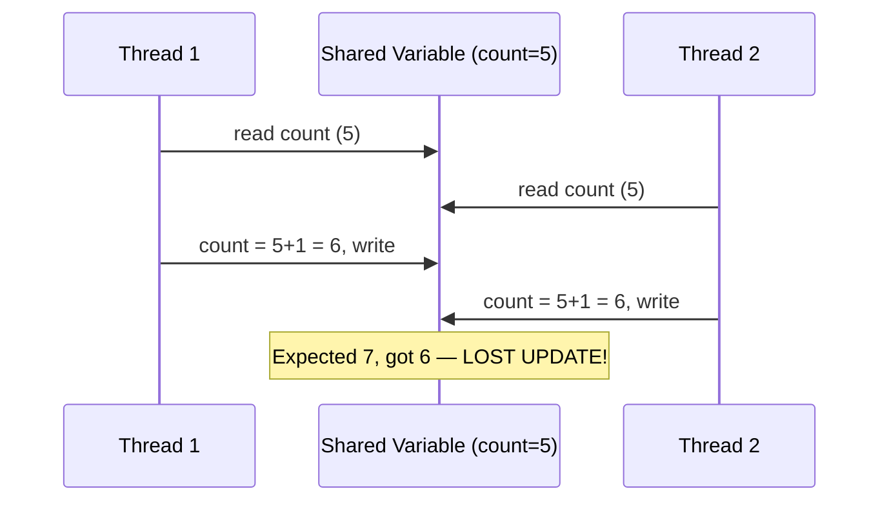

**Key takeaway:** Race conditions are the *problem*; everything else in this module (critical sections, locks, semaphores, monitors) is a **solution** to prevent them.

---

## 2. Critical Section (CS)

**Plain-language explanation:** The critical section is the specific part of a process's code where it touches shared data (a shared variable, file, buffer, etc.). The whole goal of process synchronization is to make sure **no two processes are ever inside their critical sections for the same shared resource at the same time**.

Every process using shared data follows this general structure:

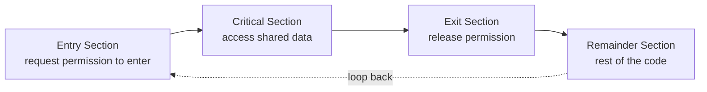

- **Entry Section:** Code that requests permission to enter the CS (e.g., acquiring a lock).
- **Critical Section:** The actual shared-data access.
- **Exit Section:** Code that signals "I'm done" (e.g., releasing a lock).
- **Remainder Section:** Everything else the process does that doesn't touch shared data.

**Analogy:** Think of a single-occupancy restroom with a lock. The "Entry Section" is checking/turning the lock; the "Critical Section" is being inside; the "Exit Section" is unlocking on the way out.

---

## 3. The Three (Four) Criteria for a Correct CS Solution

Any valid solution to the critical-section problem **must** satisfy these:

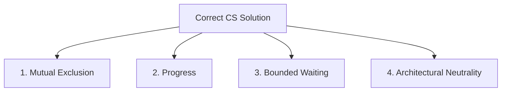

| Criterion | Meaning | Bridge Analogy |
|---|---|---|
| **1. Mutual Exclusion** | Only one process may be inside its CS at any given time | Only one car allowed on a single-lane bridge |
| **2. Progress** | If no process is currently in the CS, the decision of who enters next must be made only among processes that actually *want* to enter — and this decision cannot be postponed forever | If the bridge is empty and someone wants to cross, they *will* eventually be allowed — the system doesn't just sit idle deciding |
| **3. Bounded Waiting** | There must be a limit on how many times *other* processes are allowed to enter the CS before a specific waiting process gets its turn | No car should be stuck waiting forever while other cars keep cutting in front of it |
| **4. Architectural Neutrality** | The solution must not depend on assumptions about the number of CPUs or their relative speed | The solution should work the same whether the bridge is monitored by one guard or ten |

**GATE Trap ⚠️:** Students often confuse Progress with Bounded Waiting:
- **Progress** = the *system as a whole* doesn't stall when the CS is free.
- **Bounded Waiting** = a *specific process* isn't ignored forever in favor of others.

You can have Progress without Bounded Waiting (system keeps moving, but always favors the same process) — this is a classic conceptual GATE distinction.

---

## 4. Software Mechanisms for Mutual Exclusion

### 4.1 Lock Variable (Naive — Broken)
```c
while (lock == 1);   // busy wait
lock = 1;
// critical section
lock = 0;
```

**Why it fails:** The check (`while (lock == 1)`) and the update (`lock = 1`) are **two separate instructions**, not one atomic operation. A context switch can occur *between* them, allowing two processes to both see `lock == 0` and both proceed into the CS.

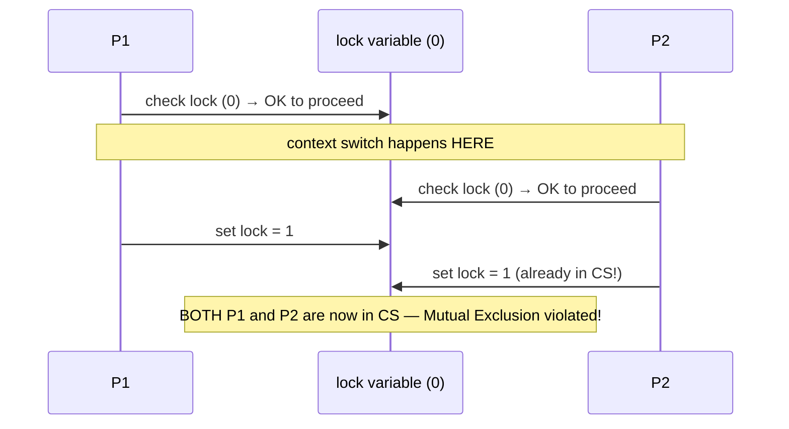

### 4.2 Strict Alternation (Turn Variable)
```c
// Process 0                  // Process 1
while (turn != 0);            while (turn != 1);
CS;                            CS;
turn = 1;                      turn = 0;
```

✅ Satisfies **Mutual Exclusion** (only the process whose `turn` it is can proceed).
❌ Violates **Progress**: if Process 0 finishes and sets `turn = 1`, but Process 1 is busy in its remainder section (doesn't want the CS right now), Process 0 **cannot re-enter the CS** even though it's free — it must wait for Process 1 to take its turn first. This forces rigid alternation even when unnecessary.

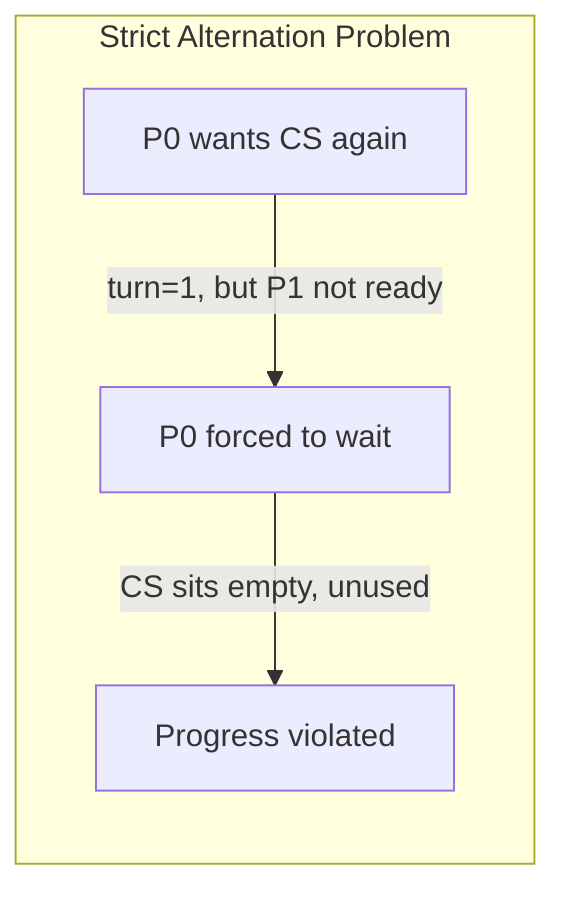

### 4.3 Peterson's Algorithm (2-Process, Software-Only)
```c
flag[i] = true;      // "I want to enter"
turn = j;             // "but I'll be polite and let you go first if you also want in"
while (flag[j] && turn == j);   // wait only if other wants in AND it's their turn
CS;
flag[i] = false;      // "I'm done"
```

**How it fixes both previous problems:**
- `flag[i]` alone would give Mutual Exclusion but risk both processes waiting forever if both set flags simultaneously → deadlock.
- `turn` alone gives strict alternation (Progress problem, as seen above).
- **Combining both** — you only wait if the other process *also* wants in AND it's officially their turn — satisfies **all three criteria** for exactly 2 processes.

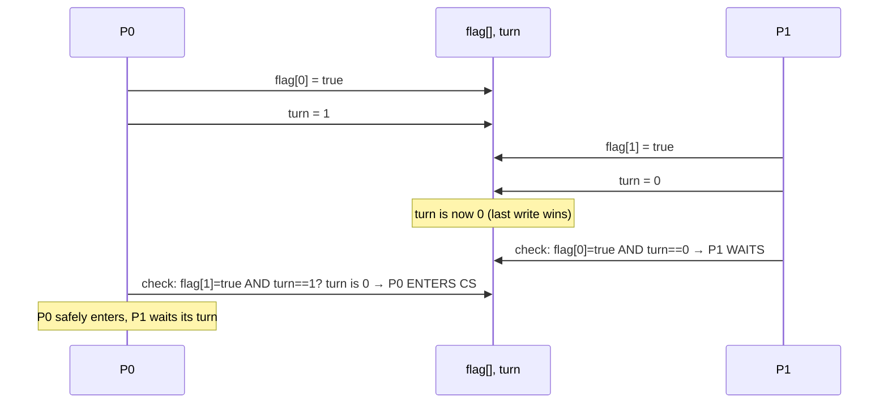

**GATE Trap ⚠️:** Peterson's Algorithm is a **very common trace question** — you'll be given a code snippet with variables changed and asked whether Mutual Exclusion/Progress/Bounded Waiting still holds. Memorize the exact code structure above.

### 4.4 Hardware: Test-and-Set Lock (TSL)
```c
boolean TestAndSet(boolean *target) {
    boolean rv = *target;
    *target = true;
    return rv;    // entire function is ATOMIC (hardware guarantees no interrupt splits it)
}

while (TestAndSet(&lock));   // acquire (busy-wait)
CS;
lock = false;                 // release
```

**Why it works:** Because the CPU guarantees the read-and-set happens as a **single indivisible hardware instruction**, there's no window for a context switch to cause the same bug as the naive lock variable.

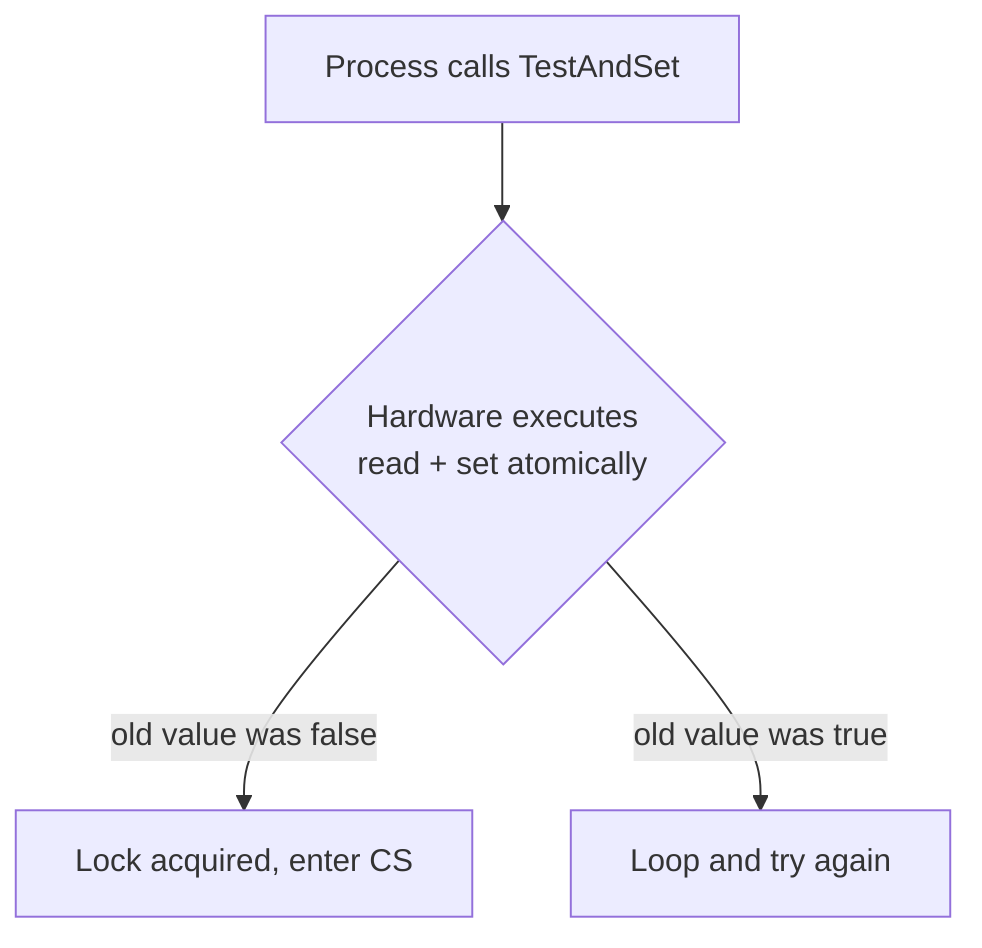

✅ Works for **any number of processes**, not just 2 — advantage over Peterson's.
⚠️ Still uses **busy-waiting** (wastes CPU cycles spinning), which semaphores with sleep/wakeup solve.

### 4.5 Disabling Interrupts
Simplest possible approach on a **single CPU**: disable interrupts before entering CS (preventing any context switch), re-enable them after.
⚠️ **Only works on uniprocessor systems.** On a multiprocessor system, disabling interrupts on one CPU doesn't stop other CPUs from concurrently entering the CS — you'd need to disable interrupts on *all* CPUs, which is expensive and impractical.

---

## 5. Semaphores

> A **semaphore** `S` is an integer variable that can only be accessed through two **atomic** operations.

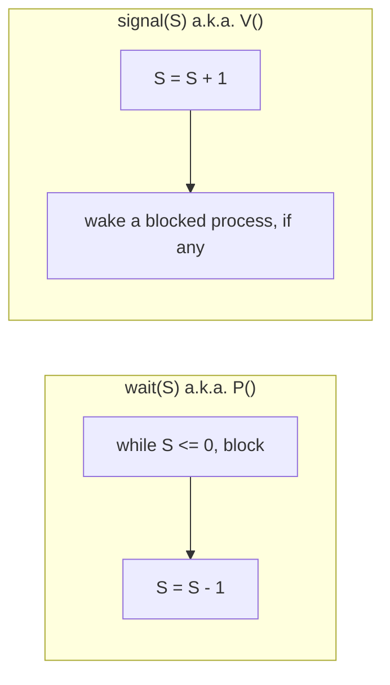

| Type | Range | Typical Use |
|---|---|---|
| **Counting Semaphore** | Any non-negative integer | Track how many instances of a resource are available (e.g., number of free buffer slots) |
| **Binary Semaphore / Mutex** | Only 0 or 1 | Simple mutual exclusion — acts like a lock |

### Busy-Waiting vs Sleep & Wakeup
The `while (S <= 0);` style of waiting **spins** the CPU (busy-waiting), wasting cycles. Real OS implementations instead put the blocked process to **sleep** (moved off the CPU into a waiting queue) and **wake it up** when the semaphore becomes available.

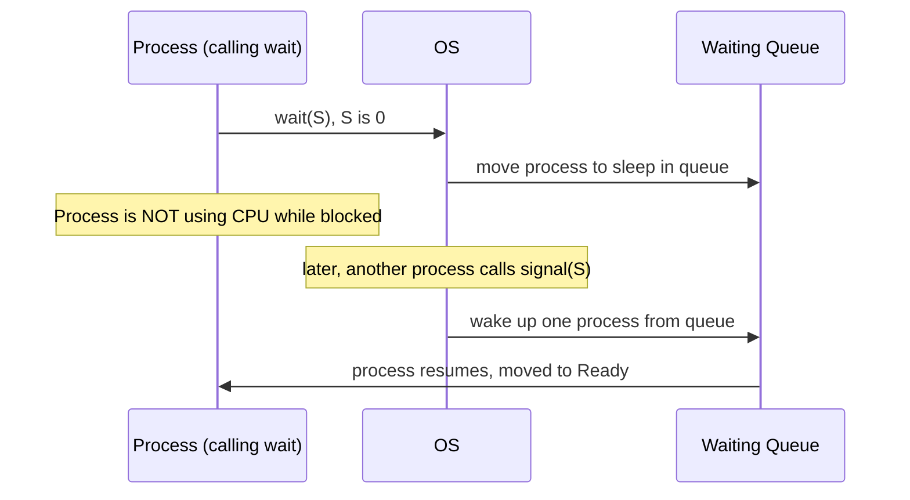

### The Lost Wakeup Problem
If a `signal`/`wakeup` is sent **before** the target process has actually gone to sleep, the wakeup is lost, and the process ends up sleeping forever (since no one will signal again). **Semaphores solve this** by making the "check condition + go to sleep" sequence atomic — no gap exists where a wakeup can slip through unnoticed.

---

## 6. Producer–Consumer Problem (Bounded Buffer)

**Setup:** A producer generates items and places them into a fixed-size buffer; a consumer removes items from the buffer. The buffer has `N` slots.


**Three semaphores needed:**
| Semaphore | Purpose | Initial Value |
|---|---|---|
| `mutex` | Mutual exclusion on buffer access itself | 1 |
| `empty` | Counts empty slots available | N |
| `full` | Counts filled slots available | 0 |

```
Producer:                          Consumer:
wait(empty);   // is there room?    wait(full);    // is there an item?
wait(mutex);   // lock buffer       wait(mutex);   // lock buffer
  add item to buffer;                 remove item from buffer;
signal(mutex); // unlock buffer     signal(mutex); // unlock buffer
signal(full);  // one more item     signal(empty); // one more free slot
```

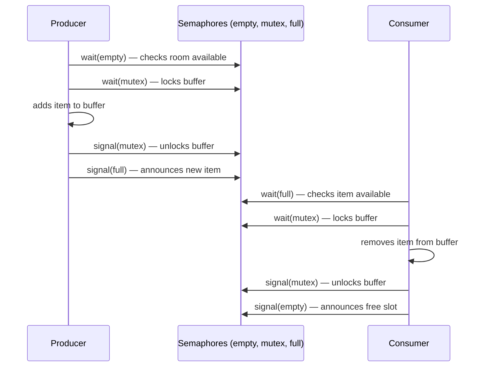

**GATE Trap ⚠️ — Order Matters:** The order `wait(empty)` then `wait(mutex)` is essential. If reversed (`wait(mutex)` before `wait(empty)`), you can get **deadlock**: the producer locks the buffer (`mutex`), then finds there's no empty slot and blocks on `wait(empty)` — but it's still holding `mutex`, so the consumer can never acquire `mutex` to remove an item and free up a slot. Everyone waits forever.

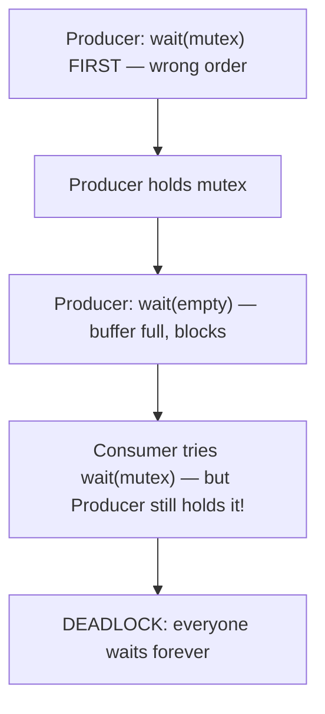

---

## 7. Readers–Writers Problem

**Setup:** A shared resource (e.g., a database record) is read by multiple **readers** and modified by **writers**.

**Rules:**
- Multiple readers may access the resource **simultaneously** (reading doesn't conflict with reading).
- A writer needs **exclusive** access — no readers and no other writers may be active at the same time.

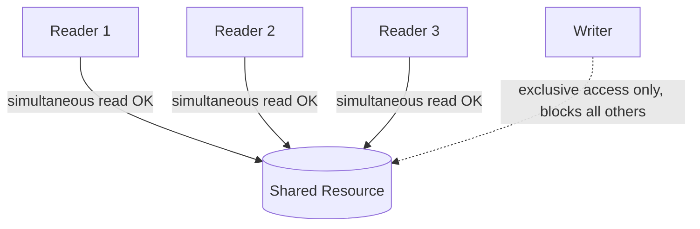

**Two classic variants:**

| Variant | Behavior | Risk |
|---|---|---|
| **Reader-priority** | Readers can keep joining even while a writer waits, as long as another reader is already active | Writers may **starve** if readers keep arriving continuously |
| **Writer-priority** | Once a writer is waiting, no *new* readers are allowed to start (existing ones finish, but no new ones join) | Readers may **starve** if writers keep arriving continuously |

**Implementation sketch (reader-priority) uses a `read_count` variable + `mutex` (protecting `read_count`) + a `write_lock` semaphore:**
- First reader to arrive locks `write_lock` (blocking writers); last reader to leave unlocks it.
- Middle readers just increment/decrement `read_count` under `mutex`, without touching `write_lock`.

---

## 8. Dining Philosophers Problem

**Setup:** 5 philosophers sit around a circular table. Between each pair of adjacent philosophers is exactly **one fork** — so there are 5 forks total. Each philosopher alternates between *thinking* and *eating*; to eat, a philosopher needs **both** the fork on their left AND the fork on their right.

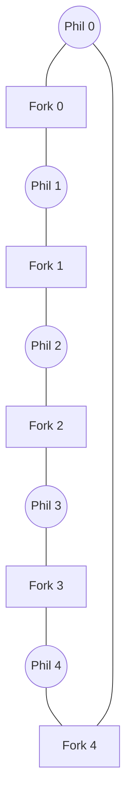

**The Deadlock Scenario:** If **all 5 philosophers simultaneously pick up their left fork**, then every fork is now held by someone, and every philosopher is stuck waiting for their right fork — which will never become free, because the philosopher holding it is also waiting. This is a **circular wait**, the classic setup for deadlock (bridges directly into Module 4).


**Standard Solutions:**

| Solution | How it Breaks the Deadlock |
|---|---|
| **1. Limit to 4 philosophers at the table** | Guarantees at least one philosopher can always get both forks, since 5 forks ÷ 4 philosophers means someone has both available |
| **2. Pick up both forks atomically** | A philosopher only picks up forks if *both* are simultaneously available, never holding just one while waiting for the other |
| **3. Asymmetric solution** | Odd-numbered philosophers pick left-then-right; even-numbered pick right-then-left — breaks the circular, symmetric waiting pattern |
| **4. Waiter/arbitrator semaphore** | A central "waiter" (a semaphore) must grant permission before any philosopher may pick up forks at all, preventing more than 4 from trying simultaneously |

---

## 9. Monitors

> A **Monitor** is a high-level programming-language construct that bundles shared data together with the procedures (methods) that operate on it, and **automatically enforces mutual exclusion** — only one process can be actively executing inside the monitor at any time.

**Why monitors are "easier" than raw semaphores:** With semaphores, the programmer must remember to correctly place every `wait()`/`signal()` call — a single misplaced or missing call can cause deadlock or broken mutual exclusion. A monitor handles the locking automatically; the programmer just writes normal procedure calls.

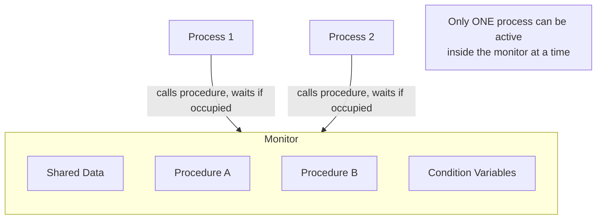

### Condition Variables
Inside a monitor, when a process needs to wait for some condition that isn't yet true (e.g., "buffer is not empty"), it uses a **condition variable**:
- `wait()` — releases the monitor lock and blocks the calling process until signaled.
- `signal()` — wakes up one process waiting on that condition (if any).

Unlike semaphores, condition variables have **no memory** — calling `signal()` when no process is waiting has no lasting effect (unlike incrementing a semaphore's counter, which persists).

---

## 10. Mutex vs. Semaphore — Direct Comparison

| Aspect | Mutex | Semaphore |
|---|---|---|
| **Value range** | Binary (locked/unlocked) | Can be any non-negative integer (counting) or binary |
| **Ownership** | Owned by the thread that locked it — only that thread should unlock it | No ownership concept — any process can signal, regardless of who called wait |
| **Purpose** | Strictly mutual exclusion (protecting a single resource) | General-purpose signaling and resource counting |
| **Typical use** | Locking a single shared variable/data structure | Managing a pool of N identical resources (e.g., buffer slots) |

---

## ✅ Master Summary of GATE Traps
- **Progress vs. Bounded Waiting:** Progress = system doesn't stall; Bounded Waiting = no individual process is starved indefinitely.
- **Naive lock variable** fails because check-then-set isn't atomic — this is *the* textbook example of why race conditions occur even with "obvious-looking" fixes.
- **Strict alternation** satisfies Mutual Exclusion but violates Progress — a subtle but favorite exam distinction.
- **Peterson's Algorithm** is a 2-process-only solution — the generalized N-process version is the **Bakery Algorithm** (sometimes tested separately).
- **TSL (Test-and-Set)** works for any number of processes but still busy-waits.
- **Semaphore order matters** in Producer-Consumer: always `wait(empty/full)` before `wait(mutex)`, never the reverse — reversing causes deadlock.
- **Dining Philosophers = circular wait = deadlock preview** for Module 4; know all four standard fixes.
- **Monitors auto-enforce mutual exclusion**; semaphores require the programmer to get every wait/signal pairing correct manually.

[⬅ Back to Module 3](./Module3-Process-Synchronization.md)
