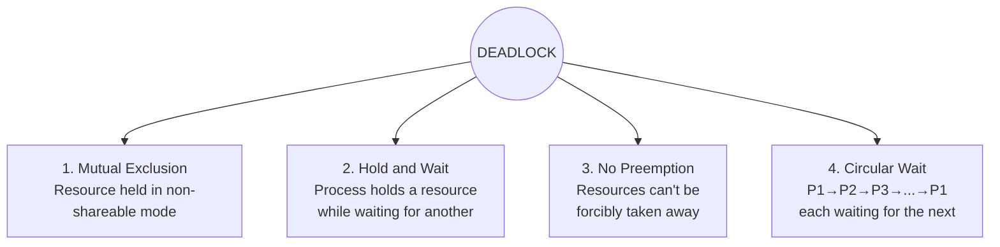
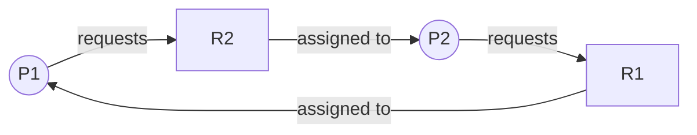
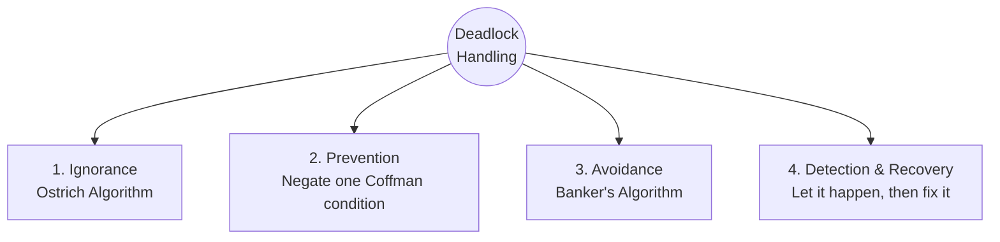
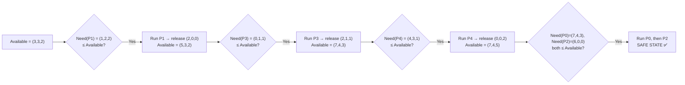

# Module 4 — Deadlock

[⬅ Back to Index](../README.md)

## 🎯 Learning Objectives
- State the 4 necessary (Coffman) conditions for deadlock
- Draw and interpret a Resource Allocation Graph (RAG)
- Apply the Banker's Algorithm to check safe states
- Distinguish deadlock prevention, avoidance, detection & recovery

⭐ **GATE Weightage:** Very High — Banker's Algorithm numericals are almost guaranteed every year.

---

## 4.1 Why Deadlocks Occur

> **Deadlock:** A set of processes is deadlocked if each process is waiting for an event (typically resource release) that only another process **in that same set** can cause.

Revisit **Dining Philosophers** (Module 3, §3.7): if all 5 philosophers grab their left fork simultaneously, each waits forever for the philosopher to their right to release a fork — classic deadlock.

### Resource Types
- **Reusable Resources:** Not consumed/destroyed by use — one process at a time (e.g., CPU, memory, files, printers).
- **Consumable Resources:** Created and destroyed dynamically (e.g., signals, interrupts, messages).

---

## 4.2 The 4 Necessary Conditions (Coffman Conditions)

> ⚠️ **All four must hold simultaneously** for deadlock to be possible. Removing even one prevents deadlock.

**Teaching cue (Traffic Jam Analogy):** Four cars at a 4-way intersection, each occupying one lane and waiting to enter the lane occupied by the car to its right.
- Mutual Exclusion → only one car can be in a lane at a time
- Hold and Wait → each car holds its lane, waiting for the next
- No Preemption → no traffic cop can force a car to reverse
- Circular Wait → the waiting forms a closed loop (A waits for B, B for C, C for D, D for A)

---

## 4.3 Resource Allocation Graph (RAG)

**Notation:**
- **Circle** = Process
- **Square** = Resource (dots inside = number of instances)
- **P → R** (request edge) = process is requesting resource
- **R → P** (assignment edge) = resource is allocated to process

### Example: Deadlock with single-instance resources

**Rule:** For **single-instance** resource types, a **cycle in the RAG ⟺ deadlock**.
For **multiple-instance** resource types, a cycle is **necessary but NOT sufficient** — you must also check if a safe allocation sequence exists.

---

## 4.4 Deadlock Handling Strategies

| Strategy | Approach | Real-World Use |
|---|---|---|
| **Ignorance (Ostrich Algorithm)** | Pretend deadlocks never happen | Windows, Linux (most general-purpose OSes — deadlocks are rare enough that prevention overhead isn't worth it) |
| **Prevention** | Design the system so one of the 4 conditions can *never* hold | E.g., request all resources at once (negates Hold & Wait) |
| **Avoidance** | Dynamically check before granting each request — only grant if system remains in a **safe state** | Banker's Algorithm |
| **Detection & Recovery** | Allow deadlock, periodically run a detection algorithm, then recover | Abort process(es) or preempt resources |

**Deadlock vs Starvation (important distinction!):**
| | Deadlock | Starvation |
|---|---|---|
| Cause | Circular wait among processes | Scheduling policy indefinitely favors others |
| Cycle needed? | Yes | No |
| Resolution | Break the cycle | Aging (gradually increase priority) |

---

## 4.5 Deadlock Avoidance — Banker's Algorithm

> Named after a banker who never allocates cash if it could leave the bank unable to satisfy *any* customer eventually.

### Key Data Structures (for `n` processes, `m` resource types)
| Structure | Size | Meaning |
|---|---|---|
| `Max` | n × m | Maximum demand of each process |
| `Allocation` | n × m | Currently allocated to each process |
| `Need` | n × m | `Need = Max − Allocation` |
| `Available` | m | Currently free instances of each resource |

### Safe State
A state is **safe** if there exists **some order** to run all processes to completion (each process's Need ≤ current Available at its turn) without deadlock.

### 📝 Solved Numerical — Banker's Algorithm

5 processes (P0-P4), 3 resource types (A, B, C):

| Process | Allocation (A B C) | Max (A B C) | Need (A B C) |
|---|---|---|---|
| P0 | 0 1 0 | 7 5 3 | 7 4 3 |
| P1 | 2 0 0 | 3 2 2 | 1 2 2 |
| P2 | 3 0 2 | 9 0 2 | 6 0 0 |
| P3 | 2 1 1 | 2 2 2 | 0 1 1 |
| P4 | 0 0 2 | 4 3 3 | 4 3 1 |

**Available = (3, 3, 2)**

**Step-by-step Safety Check:**

**Safe Sequence:** `< P1, P3, P4, P0, P2 >`

**GATE Trap ⚠️:** Students often forget to **update Available** after each process "completes" and releases its resources — you MUST add back the process's `Allocation` to `Available` before checking the next candidate.

---

## 4.6 Deadlock Detection & Recovery

- **Detection Algorithm:** Similar to Banker's safety check but without the `Max` matrix — just checks if current `Request` + `Allocation` state can find a completion sequence using `Available`.
- **Recovery options:**
  1. **Process Termination** — abort all deadlocked processes at once (simple, wasteful) OR abort one at a time until deadlock breaks (better, but requires re-running detection each time).
  2. **Resource Preemption** — forcibly take a resource from one process, give to another; needs rollback mechanism to avoid starvation.

---

## ✅ Common GATE Traps
- Believing a **cycle in RAG always means deadlock** — only true for **single-instance** resources.
- Forgetting **all 4 Coffman conditions** must hold — a question may describe a scenario missing just one condition (e.g., resources ARE preemptible) and expect you to say "no deadlock possible."
- In Banker's Algorithm, using `Max` instead of `Need` when checking safety (`Need = Max − Allocation`, always check against `Need`).
- Confusing Deadlock Avoidance (proactive, before granting) with Detection (reactive, after the fact).

---

[⬅ Previous: Process Synchronization](../03-process-synchronization/README.md) | [⬆ Index](../README.md) | [Next: Memory Management ➡](../05-memory-management/README.md)
