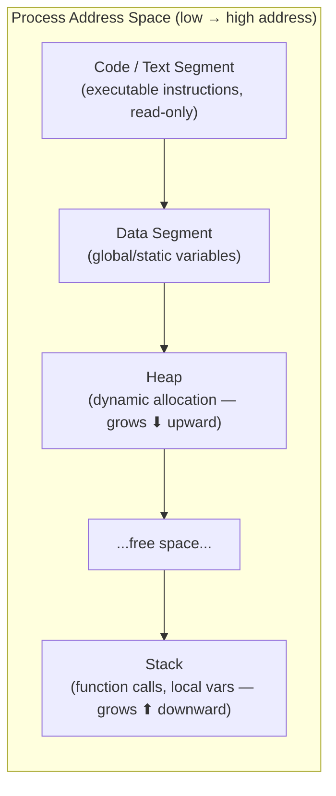
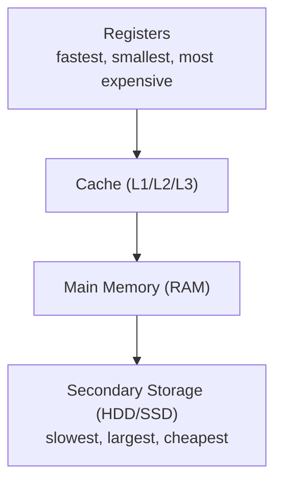
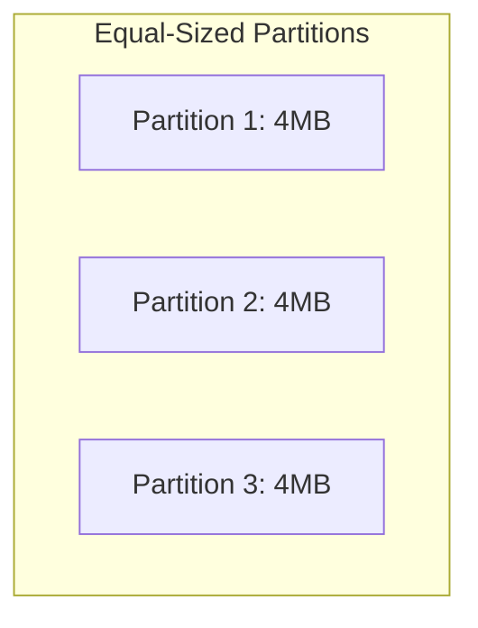
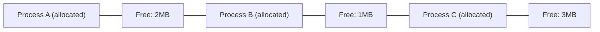
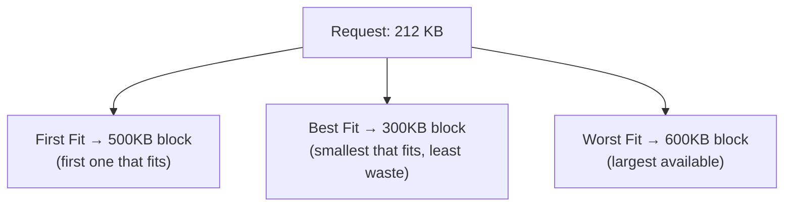
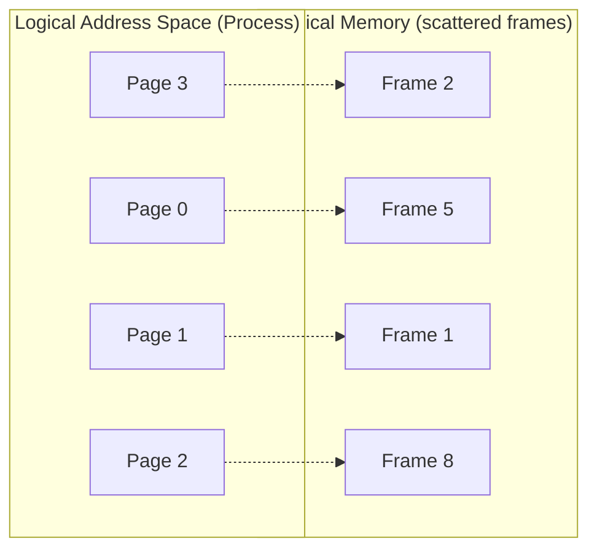
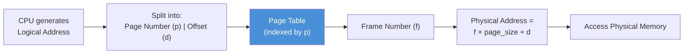
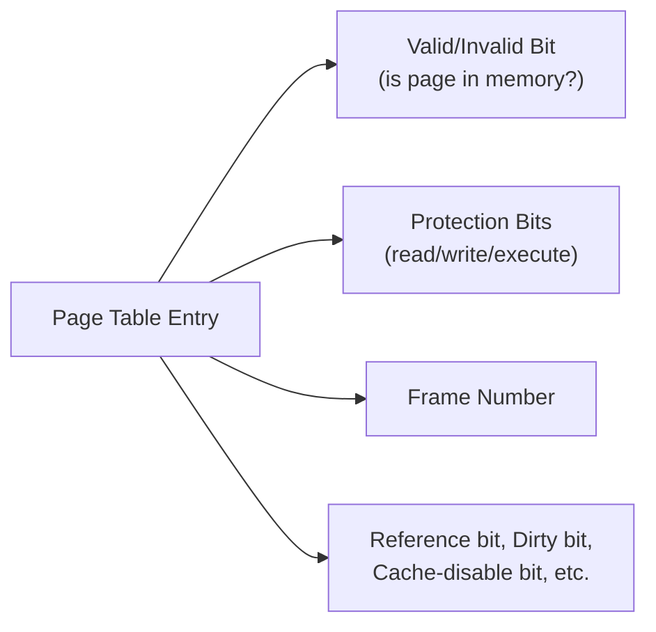
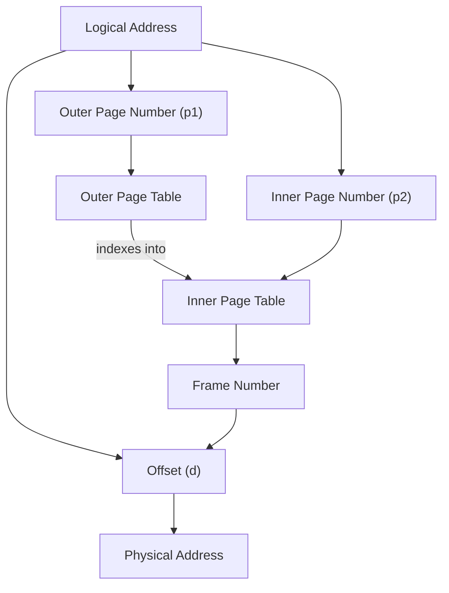

# Module 5 — Memory Management

[⬅ Back to Index](../README.md)

## 🎯 Learning Objectives
- Explain process memory layout (code/data/heap/stack)
- Differentiate contiguous allocation strategies and fragmentation types
- Apply First/Best/Worst/Next Fit allocation algorithms
- Perform address translation using paging

⭐ **GATE Weightage:** Very High — paging address translation numericals appear almost every year.

---

## 5.1 Process Memory Layout



**Teaching cue:** Draw this as a vertical memory strip. Emphasize: **Heap grows up, Stack grows down** — toward each other. If they collide → **stack overflow / heap overflow**.

**Process Creation Pipeline:**


---

## 5.2 Memory Hierarchy (Quick Revision)



---

## 5.3 Contiguous Memory Allocation

### Fixed (Static) Partitioning

- **Equal-sized:** Simple, but a small process wastes space in a large partition (**internal fragmentation**).
- **Unequal-sized:** Better fit for varying process sizes, but still causes some internal fragmentation.

> **Internal Fragmentation:** Wasted space **inside** an allocated partition (process < partition size).

### Dynamic Partitioning
Partitions are created **exactly** to fit each process's size as it's loaded.

> **External Fragmentation:** Free memory exists but is scattered in small non-contiguous chunks — not enough contiguous space for a new request even though total free memory is sufficient.


*Total free = 6MB, but a new 5MB process can't fit anywhere contiguously → external fragmentation.*

- **Compaction:** Shift all processes to one end of memory to merge free space into a single block. Effective but computationally expensive (all processes must be relocated).
- **Overlays:** Run a program larger than available memory by loading only the currently-needed portion (used *before* virtual memory existed).

---

## 5.4 Memory Allocation Algorithms

Given free blocks: `[100KB, 500KB, 200KB, 300KB, 600KB]` and a request for **212KB**:

| Algorithm | Strategy | Result for this example |
|---|---|---|
| **First Fit** | Allocate the *first* free block big enough | Picks 500KB (first one ≥ 212KB) |
| **Next Fit** | Like First Fit, but resumes search from the *last allocated position* | Depends on last allocation pointer |
| **Best Fit** | Allocate the *smallest* block that's still big enough (minimizes leftover) | Picks 300KB (smallest that fits) |
| **Worst Fit** | Allocate the *largest* available block (leaves the biggest usable leftover) | Picks 600KB |
| **Quick Fit** | Maintains separate free-lists for commonly requested sizes | Fastest for common sizes, most complex to maintain |



**GATE Trap ⚠️:** Best Fit *minimizes waste per allocation* but tends to create many **tiny unusable leftover fragments** over time — it is NOT always the best in terms of overall fragmentation.

---

## 5.5 Why Paging? (Non-Contiguous Allocation)

**Problems with contiguous allocation:** External fragmentation, need for expensive compaction, difficulty fitting large processes.

**Paging's Solution:** Divide **logical memory** into fixed-size **pages** and **physical memory** into same-size **frames**. A process's pages can be scattered across *non-contiguous* frames — no external fragmentation (though a small amount of internal fragmentation remains in the last page).



---

## 5.6 Address Translation with Paging



**Key formulas:**
```
bits for Page Number  = log2(number of pages)
bits for Offset        = log2(page size)
Physical Address       = (Frame Number × Page Size) + Offset
```

### 📝 Solved Numerical — Address Translation

Given: Logical Address Space = 8 pages of 1KB each. Page Table: `[Page 0→Frame 3, Page 1→Frame 1, Page 2→Frame 6, Page 3→Frame 2, ...]`

**Q:** Translate logical address `p=2, d=520` (in bytes).

**Solution:**
- Page 2 maps to Frame 6 (from page table)
- Physical Address = (6 × 1024) + 520 = 6144 + 520 = **6664**

**Bits Calculation variant:** If logical address space = 2²⁰ bytes, page size = 2¹⁰ bytes:
- Offset bits = log2(2¹⁰) = **10 bits**
- Page number bits = 20 − 10 = **10 bits**
- Number of pages = 2¹⁰ = **1024 pages**

---

## 5.7 Page Table Entry (PTE) Structure



- **Valid bit = 1** → page is in physical memory, frame number is valid.
- **Valid bit = 0** → page is NOT in memory → accessing it triggers a **Page Fault** (see Module 6).

---

## 5.8 Multi-Level Paging

**Why?** For a 32-bit address space with 4KB pages, a single-level page table needs 2²⁰ entries — far too large to keep entirely in memory for every process.



**Two-Level Paging Example:** 32-bit address, 4KB (2¹²) pages, page table entries of 4 bytes:
- Offset = 12 bits
- Remaining 20 bits split into p1 (outer, 10 bits) and p2 (inner, 10 bits)
- This keeps each individual page table exactly one page (4KB) in size — clean, page-aligned.

**GATE Trap ⚠️:** Multi-level paging **reduces memory wasted on page tables for sparse address spaces** (unused regions don't need inner tables allocated) but **increases the number of memory accesses** needed per translation (one extra access per level) — this is exactly why TLBs matter (see Module 6).

---

## ✅ Common GATE Traps
- Confusing **internal** (inside allocated block, due to fixed sizing) vs **external** (fragmented free space between blocks) fragmentation.
- Forgetting paging still has a *small* internal fragmentation (in the last page of a process, on average half a page wasted).
- Miscalculating bits: always double check `Offset bits = log2(page size)`, NOT `log2(number of frames)`.
- Assuming Best Fit is strictly "best" for overall memory usage — it minimizes immediate waste, not long-term fragmentation.

---

## 🧑‍🏫 Teaching Flow (60 min suggestion)
| Time | Activity |
|---|---|
| 0–10 min | Draw process memory layout (code/data/heap/stack) — explain heap ↑ vs stack ↓ |
| 10–20 min | Fixed vs dynamic partitioning, internal vs external fragmentation (use the free-block diagram) |
| 20–30 min | Fit algorithms — work the 212KB example live, ask class to vote before revealing each answer |
| 30–45 min | Why paging → address translation diagram → solved numerical |
| 45–60 min | Multi-level paging — bits calculation practice problems |

[⬅ Previous: Deadlock](../04-deadlock/README.md) | [⬆ Index](../README.md) | [Next: Virtual Memory ➡](../06-virtual-memory/README.md)
