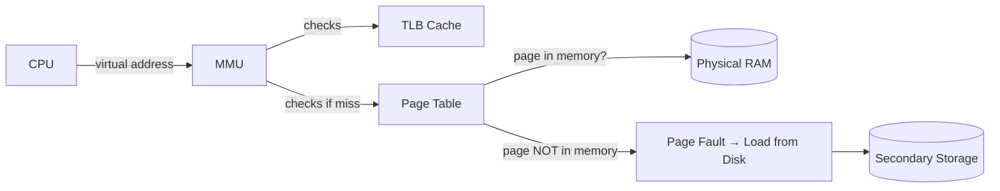
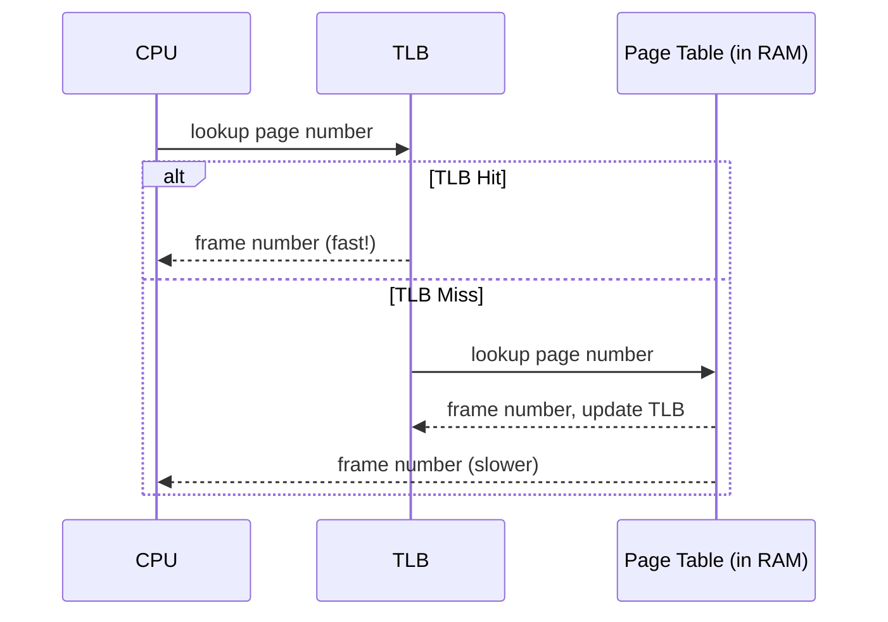
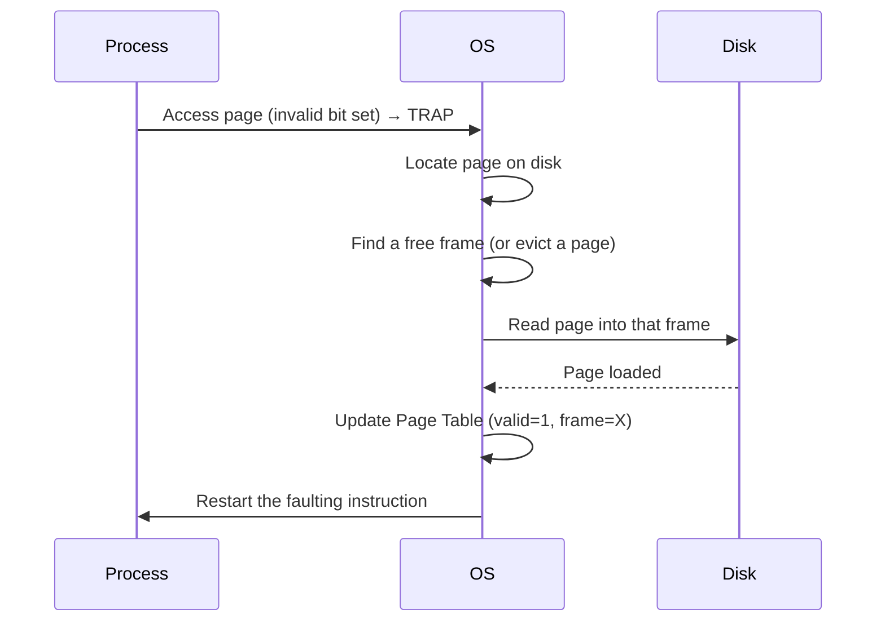
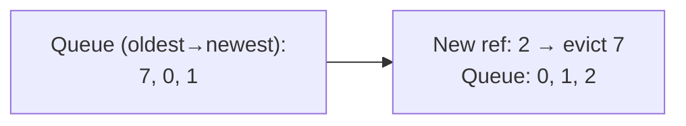
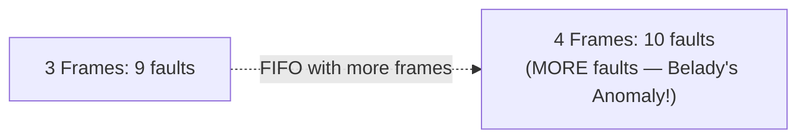
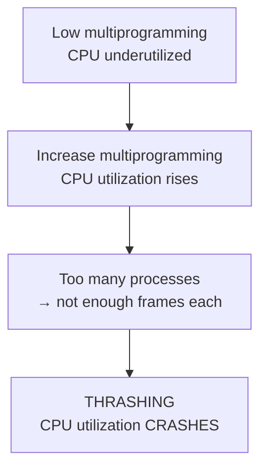
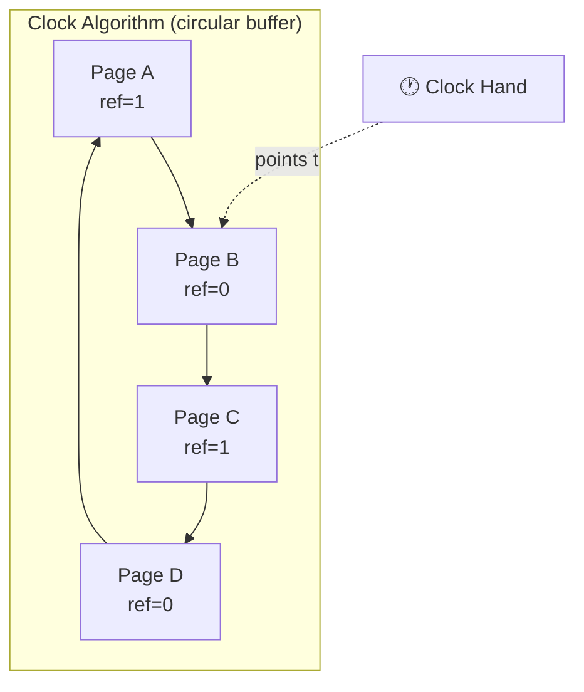

# Module 6 — Virtual Memory

[⬅ Back to Index](../README.md)

## 🎯 Learning Objectives
- Explain demand paging and locality of reference
- Compute Effective Memory Access Time (EMAT) with TLB
- Apply page replacement algorithms (FIFO, LRU, Optimal) and identify Belady's Anomaly
- Explain thrashing and the working set model

⭐ **GATE Weightage: HIGHEST in the entire syllabus** — TLB/EMAT and page replacement numericals appear almost every single year, often worth 2 marks each.

---

## 6.1 Why Virtual Memory?

> **Virtual Memory** lets a process execute even if it's not *entirely* in physical memory — giving the illusion of a memory space larger than actual RAM.

**Demand Paging:** Load a page into memory **only when it's referenced** (lazy loading) — reduces I/O and memory footprint, enables higher degree of multiprogramming.

**Locality of Reference** (the reason demand paging works well in practice):
- **Temporal locality** — recently accessed memory is likely accessed again soon (e.g., loop variables).
- **Spatial locality** — memory near a recently accessed location is likely accessed soon (e.g., array traversal).



---

## 6.2 Translation Lookaside Buffer (TLB)

> The TLB is a small, fast, hardware **cache** of recent (page number → frame number) translations — avoids a full page-table memory lookup for every access.



### 📝 Solved Numerical — Effective Access Time with TLB

Given: TLB access time = 20ns, Memory access time = 100ns, TLB hit ratio = 80%

**Case: TLB Hit** → 1 TLB access + 1 memory access = 20 + 100 = 120ns
**Case: TLB Miss** → 1 TLB access + 1 memory access (page table) + 1 memory access (actual data) = 20 + 100 + 100 = 220ns

```
EMAT = (hit ratio × hit time) + (miss ratio × miss time)
     = (0.8 × 120) + (0.2 × 220)
     = 96 + 44
     = 140 ns
```

**GATE Trap ⚠️:** Don't forget the TLB access time (20ns) is paid in **both** the hit and miss cases — it's not "replaced" by the page table lookup, it's *in addition to* it.

---

## 6.3 Page Fault Handling

> **Page Fault:** Occurs when a process references a page whose *valid bit = 0* (not currently in physical memory).



### EMAT with Page Faults

```
EMAT = (1 − p) × ma + p × page_fault_service_time
```
where `p` = page fault probability, `ma` = memory access time.

### 📝 Solved Numerical — EMAT with Page Fault Probability

Given: `ma = 100ns`, page fault service time = 8ms = 8,000,000ns, page fault rate `p = 0.001` (1 in 1000 accesses)

```
EMAT = (1 − 0.001) × 100 + 0.001 × 8,000,000
     = 0.999 × 100 + 8000
     = 99.9 + 8000
     = 8099.9 ns  ≈ 8.1 μs
```

**Teaching cue:** This dramatically shows *why* page fault rate must be kept extremely low — even a 0.1% fault rate makes access **80× slower**.

---

## 6.4 Page Replacement Algorithms

**Need:** When memory is full and a page fault occurs, the OS must **evict** some page to make room for the new one.

### Reference String Example (used across all algorithms below):
```
Reference String: 7, 0, 1, 2, 0, 3, 0, 4, 2, 3, 0, 3, 2, 1, 2, 0, 1, 7, 0, 1
Frames available: 3
```

### (a) FIFO — First In First Out
Evict the page that has been in memory **longest**.


For the reference string above with 3 frames: **FIFO gives 15 page faults**.

### (b) Optimal (OPT / MIN)
Evict the page that will **not be used for the longest time in the future**. Theoretical best — impossible to implement (requires knowing the future), but used as a **benchmark**.
For the same string: **Optimal gives 9 page faults** (fewest possible).

### (c) LRU — Least Recently Used
Evict the page that hasn't been used for the **longest time in the past** (approximates Optimal using history instead of future knowledge).
For the same string: **LRU gives 12 page faults**.

### Belady's Anomaly
> Counter-intuitively, **increasing the number of frames can INCREASE page faults** — this happens with **FIFO**, but never with **stack algorithms** like LRU and Optimal.



**Stack Algorithms:** Algorithms where the set of pages in memory for `n` frames is always a **subset** of the set for `n+1` frames. LRU and Optimal are stack algorithms (immune to Belady's Anomaly); FIFO is NOT.

---

## 6.5 Thrashing & Working Set

> **Thrashing:** A process spends more time paging (swapping pages in/out) than executing actual instructions — occurs when a process doesn't have enough frames to hold its **working set**.




**Working Set Model:** The set of pages a process has referenced in the most recent time window `Δ` (delta). If a process's frame allocation < its working set size → thrashing risk.

### Practical Page-Replacement Implementations
| Technique | Idea |
|---|---|
| **NRU (Not Recently Used)** | Classifies pages into 4 classes using reference & modify bits; evicts from lowest non-empty class |
| **Second Chance** | FIFO + reference bit check — if bit is set, give the page "a second chance" (clear bit, move to back of queue) instead of evicting immediately |
| **Clock Algorithm** | Circular implementation of Second Chance using a "clock hand" pointer — efficient, widely used in real OSes |
| **LFU (Least Frequently Used)** | Evict the page with the smallest reference **count** (not recency) |



---

## 6.6 Segmentation (brief)

> **Segmentation:** Divides a process into logically meaningful **variable-sized** segments (code, data, stack) — matches how a programmer thinks about a program, unlike paging's fixed-size mechanical division.

**Segmented Paging (Paged Segmentation):** Combines both — each segment is itself divided into fixed-size pages. Gets the logical benefits of segmentation + the no-external-fragmentation benefit of paging.

| | Paging | Segmentation |
|---|---|---|
| Division | Fixed-size (physical) | Variable-size (logical) |
| Fragmentation | Internal only | External (segments vary in size) |
| Programmer visibility | Invisible | Visible (matches program structure) |
| Address | (page #, offset) | (segment #, offset) |

---

## ✅ Common GATE Traps
- Forgetting to add TLB access time in the **miss** case EMAT formula (it's TLB + page table + memory, not just page table + memory).
- Applying Belady's Anomaly logic to LRU/Optimal — it **only** affects non-stack algorithms like FIFO.
- Confusing thrashing's *cause* (too little memory per process) with its *symptom* (low CPU utilization despite high multiprogramming — the counter-intuitive part).
- Miscounting page faults — the FIRST reference to any page is always a fault (cold start), don't forget to count it.

---

## 🧑‍🏫 Teaching Flow (75 min suggestion — this module needs extra time)
| Time | Activity |
|---|---|
| 0–15 min | TLB diagram + EMAT numerical (work through live, this is THE most exam-critical numerical in the whole syllabus) |
| 15–25 min | Page fault handling sequence diagram + EMAT-with-fault-probability numerical |
| 25–50 min | Page replacement — run FIFO, LRU, Optimal side-by-side on the SAME reference string on the board so students see the fault-count contrast directly |
| 50–60 min | Belady's Anomaly demo — show the counter-intuitive frame-increase example |
| 60–75 min | Thrashing + working set + Clock algorithm — tie back to "why does my laptop freeze when too many apps are open?" |

[⬅ Previous: Memory Management](../05-memory-management/README.md) | [⬆ Index](../README.md) | [Next: File System Management ➡](../07-file-system-management/README.md)
