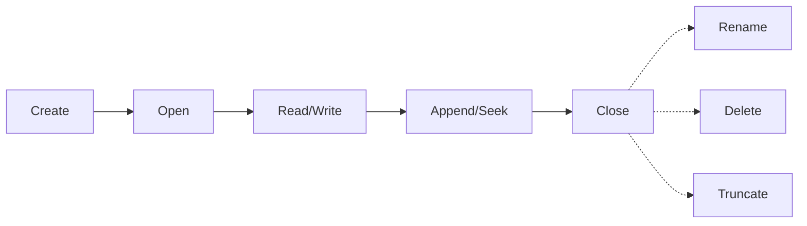
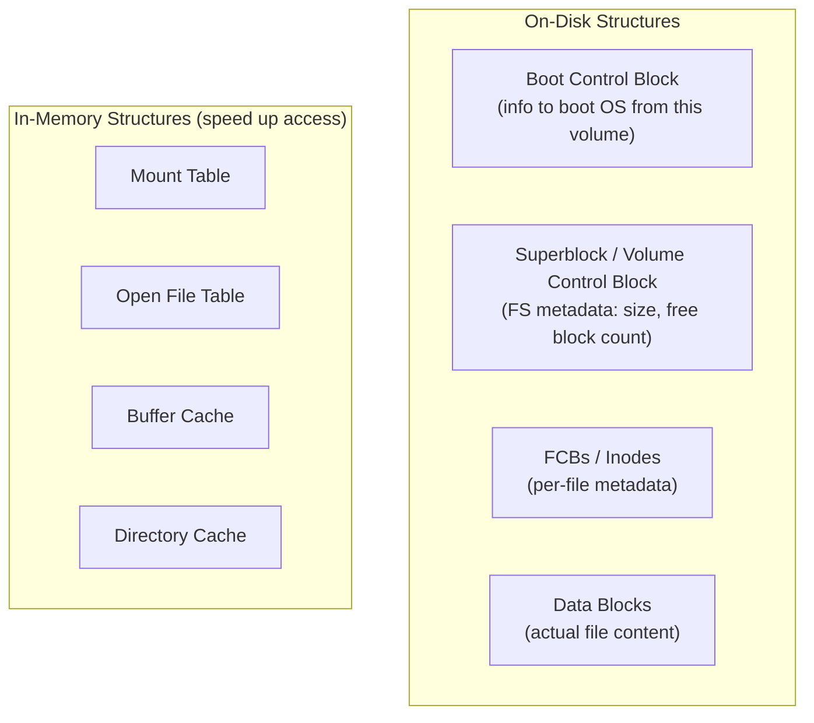
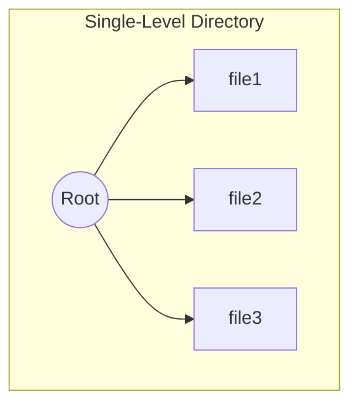
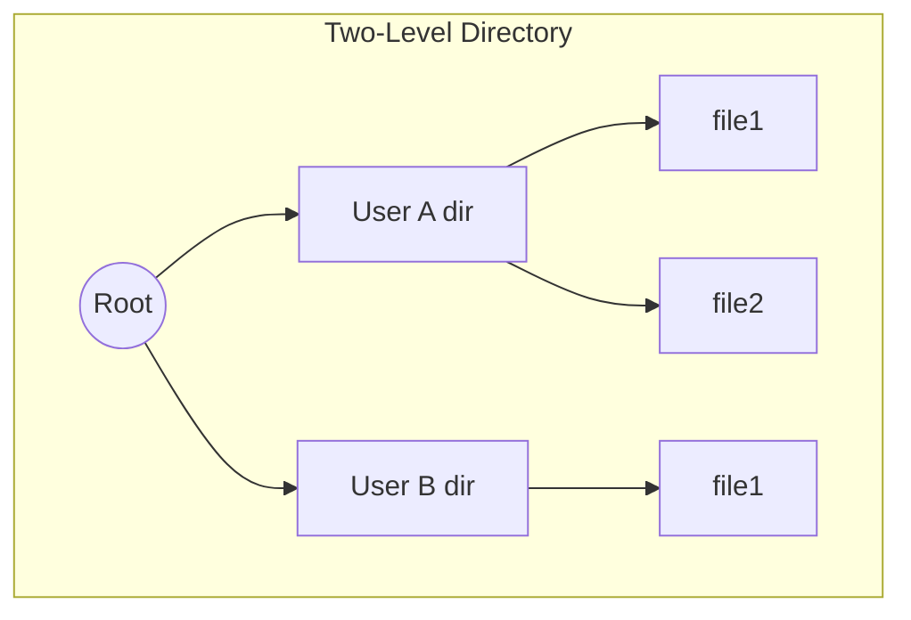
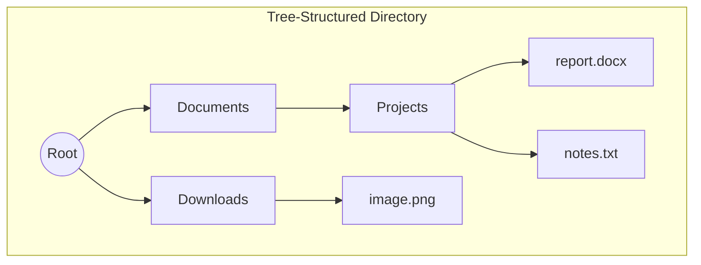
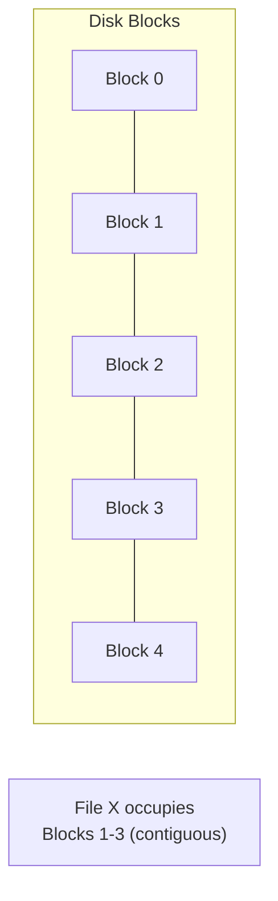
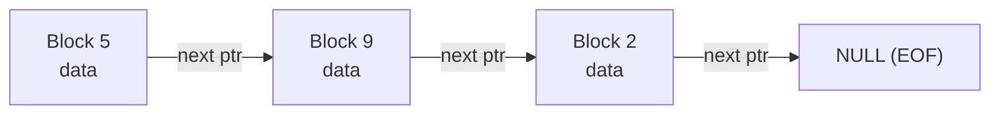
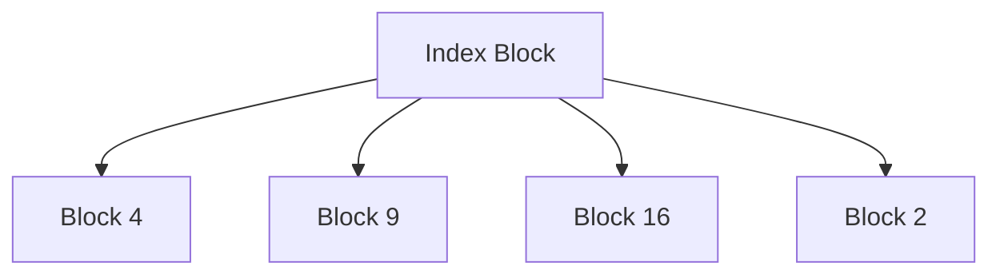
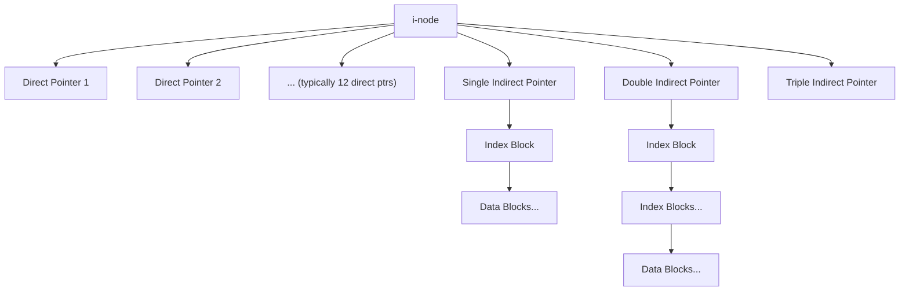
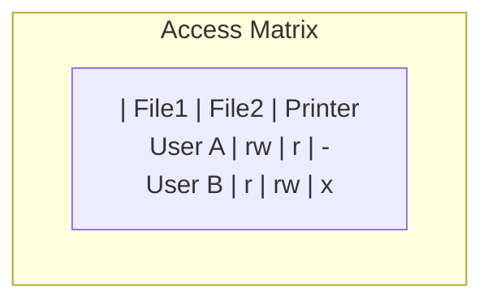

# Module 7 — File System Management

[⬅ Back to Index](../README.md)

## 🎯 Learning Objectives
- Explain file attributes, operations, and access methods
- Compare directory structures
- Apply and compare file allocation methods (contiguous, linked, indexed, i-node)
- Explain free space management techniques

⭐ **GATE Weightage:** Moderate — usually conceptual MCQs + occasional i-node numerical.

---

## 7.1 Files — Basics

> A **file** is a named collection of related information recorded on secondary storage.

**File Attributes:** Name, identifier, type, size, location, protection, timestamps.

**File Control Block (FCB):** OS data structure storing file metadata (permissions, size, disk location, etc.) — think of it as the PCB's counterpart, but for files.

**File Operations:**


---

## 7.2 File Access Methods

| Method | Description | Analogy |
|---|---|---|
| **Sequential Access** | Read/write records in order, one after another | Cassette tape |
| **Direct (Random) Access** | Jump directly to any block via block number | Vinyl record — needle anywhere |
| **Indexed Sequential Access** | Sequential + an index for faster direct lookup | Book with a table of contents |

---

## 7.3 File System Organization (On-Disk vs In-Memory)



---

## 7.4 Directory Structures


❌ All files in ONE directory — no organization for multiple users, name collisions.


✅ Each user gets their own directory — solves naming collisions across users.


✅ Hierarchical — subdirectories within subdirectories (most common structure today).

**Acyclic Graph Directory:** Allows a file/subdirectory to be **shared** (via links) between multiple directories, but with **no cycles** — a file can have multiple paths leading to it.

**Implementation:**
- **Linear List:** Simple array/list of filename-pointer pairs — slow linear search.
- **Hash Table:** Hashes filename to get pointer directly — much faster lookup.

---

## 7.5 File Allocation Methods

### Contiguous Allocation

✅ Fast sequential AND direct access. ❌ External fragmentation, hard to grow a file (needs to move if next block taken).

### Linked Allocation

✅ No external fragmentation, easy to grow. ❌ Slow random/direct access (must traverse from start), pointer overhead per block, risk if a pointer gets corrupted.

### FAT (File Allocation Table)
Like linked allocation, but the "next block" pointers are stored in a **single table in memory** (not scattered inside data blocks) — faster since the whole chain can be traversed in RAM without repeated disk reads.

### Indexed Allocation

✅ Supports direct access (index has all block addresses). ❌ Index block itself has a size limit → problem for very large files (solved by multi-level indexing).

### UNIX i-node Structure

**Teaching cue:** Direct pointers handle **small files fast** (no extra indirection); single/double/triple indirect pointers let a file grow **huge** while keeping the i-node itself small and fixed-size.

### 📝 Solved Numerical — i-node Max File Size

Given: 12 direct pointers, 1 single-indirect, 1 double-indirect, 1 triple-indirect. Block size = 4KB, pointer size = 4 bytes → pointers per index block = 4096/4 = **1024**.

```
Direct:          12 blocks
Single Indirect: 1024 blocks
Double Indirect: 1024 × 1024 = 1,048,576 blocks
Triple Indirect: 1024³ = 1,073,741,824 blocks

Max file size = (12 + 1024 + 1024² + 1024³) × 4KB
```

### Comparative Summary

| Method | Random Access | External Frag? | Best For |
|---|---|---|---|
| Contiguous | Fast | Yes | Read-mostly, known-size files (e.g., video) |
| Linked | Slow | No | Sequential-access files |
| FAT | Moderate | No | Simpler flash/embedded file systems |
| Indexed (single) | Fast | No | Moderate-size files |
| UNIX i-node | Fast (small), moderate (huge) | No | General-purpose (used in ext2/3/4, etc.) |

---

## 7.6 Free Space Management

| Technique | How it works |
|---|---|
| **Bit Vector (Bitmap)** | One bit per block: 1 = allocated, 0 = free. Simple, but scanning for a free block can be slow on huge disks. |
| **Linked List (Free List)** | Free blocks linked together in a chain. No wasted space for a bitmap, but traversal is slow. |
| **Grouping** | First free block stores addresses of several other free blocks — speeds up finding many free blocks at once. |
| **Counting** | Stores address of first free block in a contiguous run + count of following free blocks — exploits the fact that free blocks are often contiguous. |

---

## 7.7 Protection

- **Protection Goals:** Confidentiality, Integrity, Availability applied to files.
- **Access Rights:** Read, Write, Execute, Append, Delete.
- **Mechanisms:**
  - **Access Matrix** — rows = domains/users, columns = files/objects, cell = permitted operations.
  - **ACL (Access Control List)** — attached to each **object**, lists which subjects can do what.
  - **Capability List** — attached to each **subject**, lists which objects they can access and how.



---

## 7.8 UNIX File Permissions

```
-rwxr-xr--
 │││ │││ │││
 │││ │││ └── Others: read only
 │││ └────── Group: read + execute
 └────────── Owner: read + write + execute
```
- Three permission classes: **Owner, Group, Others**
- Each has **r (read), w (write), x (execute)**
- Octal representation: r=4, w=2, x=1 → e.g., `754` = rwxr-xr--
- `chmod` changes permissions, `chown` changes ownership.

---

## ✅ Common GATE Traps
- Confusing linked allocation's "no external fragmentation" with "no overhead" — it has **pointer storage overhead** per block.
- Forgetting that indexed allocation's index block has a **fixed size limit**, requiring multi-level indexing for large files (this is exactly why UNIX uses direct + indirect pointers together).
- Mixing up ACL (per-object) vs Capability List (per-subject) — GATE loves this distinction.
- Octal permission conversion errors — always decompose as 4(r)+2(w)+1(x).

---

## 🧑‍🏫 Teaching Flow (50 min suggestion)
| Time | Activity |
|---|---|
| 0–10 min | File basics + access methods (use analogies: tape, vinyl, book index) |
| 10–20 min | Directory structures — draw all 3 live, discuss pros/cons |
| 20–35 min | File allocation methods — draw contiguous/linked/indexed, then the i-node diagram; do the max-file-size numerical |
| 35–45 min | Free space management + Access Matrix/ACL/Capability comparison |
| 45–50 min | UNIX permissions — quick octal conversion drill |

[⬅ Previous: Virtual Memory](../06-virtual-memory/README.md) | [⬆ Index](../README.md) | [Next: I/O & Disk Scheduling ➡](../08-io-and-disk-scheduling/README.md)
