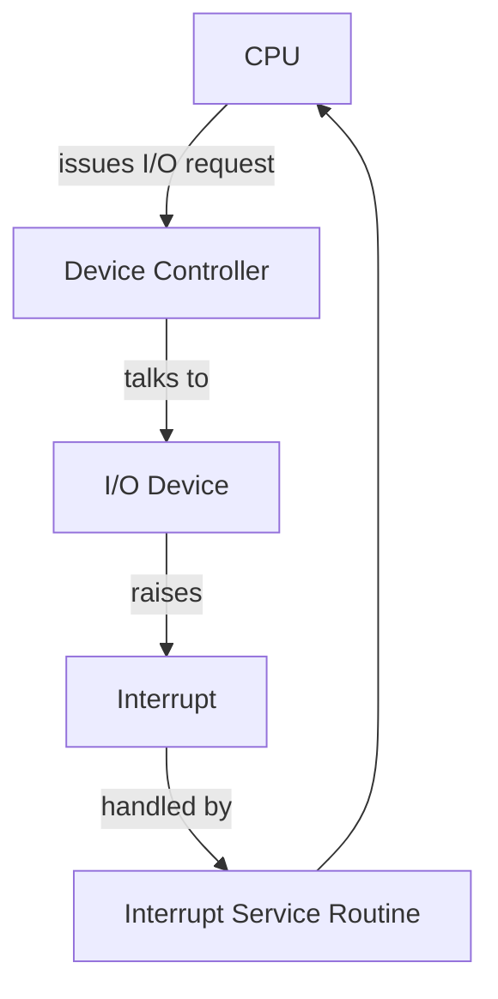
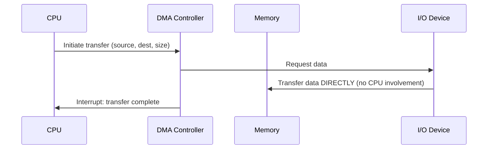
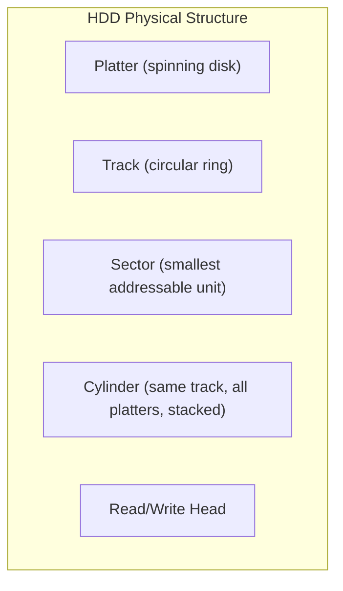
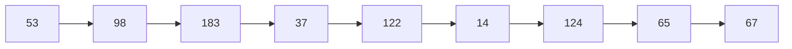
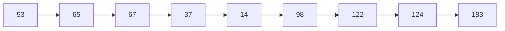
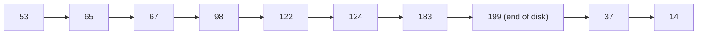
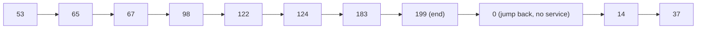
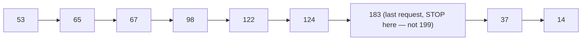
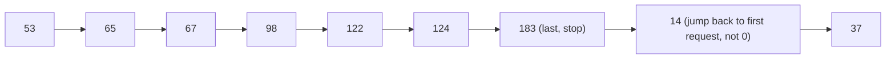

# Module 8 — I/O System Management & Disk Scheduling

[⬅ Back to Index](../README.md)

## 🎯 Learning Objectives
- Explain I/O hardware components: controllers, interrupts, DMA
- Compute disk access time (seek + rotational latency + transfer)
- Apply and compare disk scheduling algorithms: FCFS, SSTF, SCAN, C-SCAN, LOOK, C-LOOK

⭐ **GATE Weightage:** High — head-movement numericals are a recurring favorite.

---

## 8.1 I/O Hardware Basics



- **Device Controller:** Hardware that operates a specific device, translating between the device and the system bus.
- **Interrupt Handling:** CPU is *interrupted* when I/O completes — far more efficient than continuously polling the device.
- **ISR (Interrupt Service Routine):** Code that executes in response to an interrupt.

### DMA (Direct Memory Access)



**Why DMA?** Without it, the CPU must copy every single byte between device and memory — huge overhead for bulk transfers (e.g., disk reads). DMA offloads this entirely, freeing the CPU to do other work during the transfer.

**DMA vs Interrupt-driven I/O:**
| | Interrupt-driven I/O | DMA |
|---|---|---|
| CPU involvement | Per data unit (byte/word) | Only to start/end transfer |
| Best for | Small, infrequent transfers | Large, bulk transfers (disk, network) |

---

## 8.2 Secondary Storage — HDD Structure



**Disk Access Time:**
```
Total Access Time = Seek Time + Rotational Latency + Transfer Time
```
- **Seek Time:** Time to move the read/write head to the correct **track**.
- **Rotational Latency:** Time for the desired **sector** to rotate under the head.
- **Transfer Time:** Time to actually transfer the data.

### 📝 Solved Numerical — Disk Access Time

Given: Seek time = 8ms, Rotational speed = 6000 RPM, Transfer rate = 100 MB/s, block size = 1KB

```
Rotational Latency (avg) = 1/2 × (60,000 ms / 6000 RPM) = 1/2 × 10ms = 5ms
Transfer Time = 1KB / 100MB/s = 1/(100×1024) s ≈ 0.0098 ms

Total Access Time = 8 + 5 + 0.0098 ≈ 13.01 ms
```

**GATE Trap ⚠️:** Average rotational latency = **half** a full rotation (not a full rotation) — the head could arrive at any random point relative to the target sector.

---

## 8.3 SSD (Solid State Drive) — Quick Comparison

| | HDD | SSD |
|---|---|---|
| Mechanism | Spinning platters, moving head | Flash memory, no moving parts |
| Seek time | Significant (mechanical) | ~Zero |
| Wear | Mechanical wear | **Wear leveling** needed (flash cells degrade after limited write cycles) |
| Speed | Slower | Much faster, especially random access |

---

## 8.4 Disk Scheduling — Why & Goal

**Need:** Minimize total head movement (seek time) across multiple pending I/O requests, while balancing fairness (avoiding starvation).

### Setup for All Examples Below:
```
Disk has 200 tracks (0–199)
Request queue: 98, 183, 37, 122, 14, 124, 65, 67
Current head position: 53
```

---

### (a) FCFS — First Come First Serve

Services requests in the exact order received.


**Total head movement:** `|98-53| + |183-98| + |37-183| + |122-37| + |14-122| + |124-14| + |65-124| + |67-65|`
`= 45 + 85 + 146 + 85 + 108 + 110 + 59 + 2 = 640` tracks

❌ No seek optimization — huge, erratic head movement.

---

### (b) SSTF — Shortest Seek Time First

Always services the **closest** pending request to the current head position.


**Total head movement:** `12+2+30+23+84+24+2+59 = 236` tracks

✅ Much better than FCFS. ❌ Can **starve** far-away requests if closer requests keep arriving (**SSTF Starvation**).

---

### (c) SCAN (Elevator Algorithm)

Head moves in **one direction**, servicing requests along the way, until it hits the end of the disk, then **reverses**.


*(Assuming head moves toward higher tracks first)*
**Total head movement:** `(199-53) + (199-14) = 146 + 185 = 331` tracks

✅ Like a building elevator — no starvation. Behavior mimics that name.

---

### (d) C-SCAN (Circular SCAN)

Like SCAN, but after reaching one end, the head jumps **directly back to the beginning** (0) WITHOUT servicing requests on the return trip, then continues in the same direction.


✅ More **uniform wait time** for all requests (treats disk as circular) — fairer than plain SCAN.

---

### (e) LOOK

Like SCAN, but the head only goes as far as the **last request** in each direction (doesn't travel all the way to the disk's physical end if there's no request there).



### (f) C-LOOK

Like C-SCAN, but jumps back only to the **first pending request** (not all the way to track 0).



---

## 8.5 Comparative Summary

| Algorithm | Fairness | Avg Seek Time | Starvation Risk |
|---|---|---|---|
| FCFS | Fair (by arrival) | Worst | No |
| SSTF | Unfair to far requests | Best (short-term) | **Yes** |
| SCAN | Fair | Good | No |
| C-SCAN | Most uniform | Good | No |
| LOOK | Fair, avoids wasted end-travel | Better than SCAN | No |
| C-LOOK | Most uniform + avoids wasted travel | Best overall balance | No |

**Teaching cue:** LOOK/C-LOOK are essentially "smarter" versions of SCAN/C-SCAN — same idea, but don't waste time going all the way to the physical disk edge if nothing's waiting there.

---

## 8.6 Modern I/O — SSD-era Concepts

- **NVMe (Non-Volatile Memory Express):** High-performance protocol for SSDs over PCIe, supporting massively parallel command queues (thousands of queues, unlike SATA's single queue).
- **TRIM Command:** Tells the SSD which blocks are no longer in use (deleted files) so it can erase them proactively — keeps write performance from degrading over time.
- **HDD vs SSD Scheduling:** Since SSDs have negligible seek time, traditional arm-scheduling algorithms (SCAN, C-SCAN) matter far less; SSD-aware scheduling instead focuses on **maximizing parallel queue depth** and wear leveling.

---

## ✅ Common GATE Traps
- Forgetting that **average rotational latency = half a rotation**, not a full rotation.
- In SCAN/C-SCAN, forgetting to include the "trip to the disk boundary" (0 or max track) in total head movement calculations — some questions want you to include it, others (LOOK-style) don't. **Read the question carefully.**
- Confusing C-SCAN's "no service on return" rule — only NEW requests going the other direction, existing pending ones in the return path DO get serviced eventually once head moves again.
- Direction assumption — always confirm which direction the head is moving initially (toward 0 or toward max track); GATE questions state this explicitly.

---

## 🧑‍🏫 Teaching Flow (60 min suggestion)
| Time | Activity |
|---|---|
| 0–10 min | I/O hardware + DMA sequence diagram — "why not just use interrupts for everything?" |
| 10–20 min | Disk structure (tracks/sectors/cylinders) + access time formula + solved numerical |
| 20–50 min | Work through the SAME request queue with FCFS → SSTF → SCAN → C-SCAN → LOOK → C-LOOK live on the board — this contrast is the single best way to teach this topic |
| 50–60 min | Modern I/O (NVMe/TRIM/SSD) — discuss why classical algorithms matter less on SSDs |

[⬅ Previous: File System Management](../07-file-system-management/README.md) | [⬆ Index](../README.md) | [Next: Protection, Security & IPC ➡](../09-protection-security-ipc/README.md)
