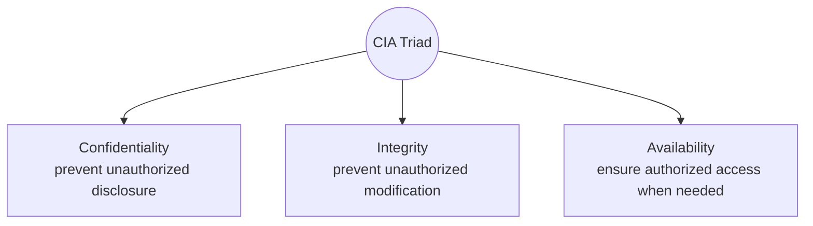
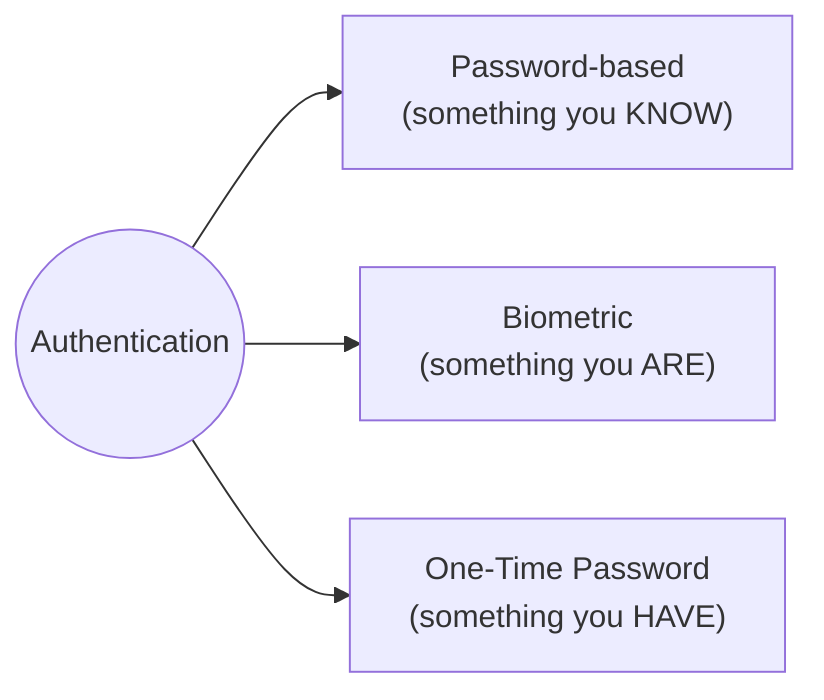
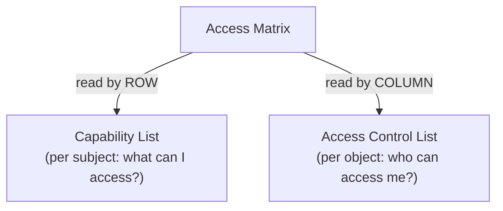
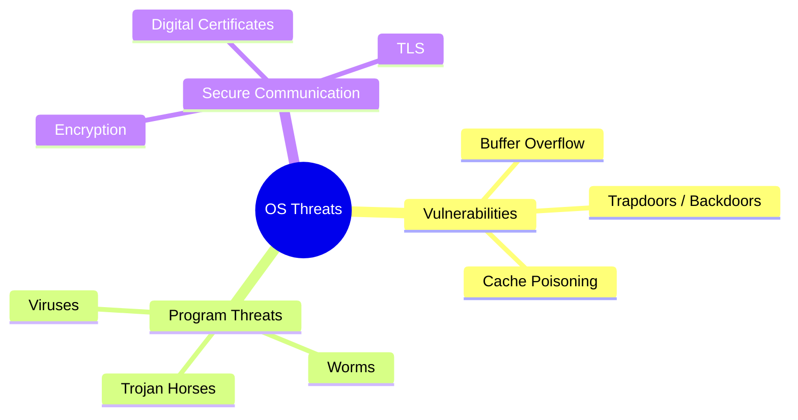
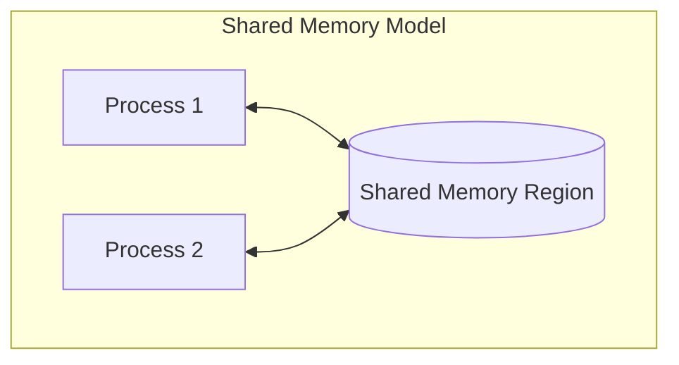
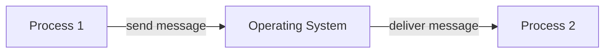
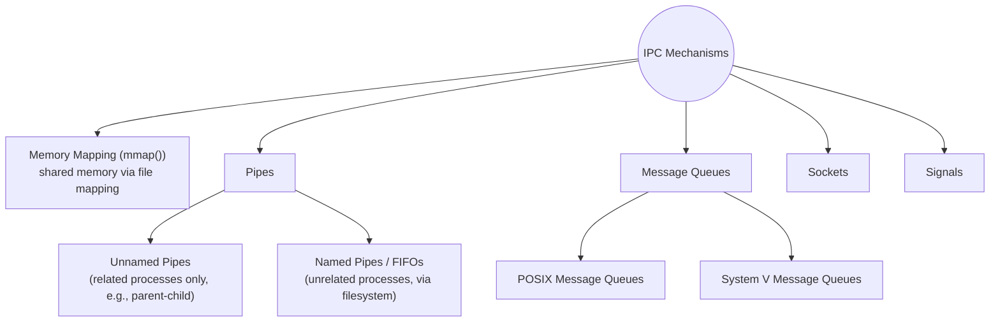

# Module 9 — Protection, Security & Interprocess Communication (IPC)

[⬅ Back to Index](../README.md)

## 🎯 Learning Objectives
- Distinguish protection from security, and explain the CIA triad
- Compare Access Matrix, ACLs, and Capability Lists
- Identify common OS/program threats
- Explain IPC models: shared memory vs message passing, and their mechanisms

⭐ **GATE Weightage:** Low-Moderate — mostly conceptual MCQs.

---

## 9.1 Protection vs Security

| | Protection | Security |
|---|---|---|
| Scope | **Internal** mechanism controlling access to resources | **Broader** — defends against external + internal threats |
| Question it answers | "Who is allowed to do what?" | "How do we defend the system from attackers?" |
| Example | File permission bits (rwx) | Firewalls, encryption, authentication |

### CIA Triad (Protection Goals)

**Teaching cue:** Ask students to classify real attacks: "A DDoS attack breaks which pillar?" (**Availability**). "Someone reads your private messages" (**Confidentiality**). "Someone edits your bank balance" (**Integrity**).

---

## 9.2 Authentication Methods

**Multi-factor authentication** = combining 2+ of these categories for stronger security.

---

## 9.3 Access Control Structures

### Domain of Protection
- **Users, Groups, Roles** define the scope of a subject's access.

### Access Matrix

|         | File1     | File2     | Printer |
|---------|-----------|-----------|---------|
| **User A** | read, write | read      | –       |
| **User B** | read      | read, write | execute |

- **Reading a row** (per subject) → gives you a **Capability List** for that user.
- **Reading a column** (per object) → gives you an **Access Control List (ACL)** for that file/resource.

**GATE Trap ⚠️:** ACL and Capability List are two different **decompositions of the same access matrix** — not competing technologies, just different storage strategies (ACL is efficient for "who can access this file?", Capability is efficient for "what can this user access?").

---

## 9.4 OS Threats & Security Concepts

| Threat | Description |
|---|---|
| **Buffer Overflow** | Writing beyond an allocated buffer's bounds, potentially overwriting adjacent memory to execute malicious code |
| **Trapdoor/Backdoor** | Hidden entry point that bypasses normal authentication |
| **Cache Poisoning** | Corrupting cached data (e.g., DNS cache) to redirect or mislead a system |
| **Virus** | Attaches itself to a legitimate program; spreads when that program executes |
| **Worm** | Self-replicating; spreads across a network **without** needing to attach to a host program |
| **Trojan Horse** | Disguised as legitimate/useful software, but carries a hidden malicious payload |

**Secure Communication:**
- **Encryption** — transforms data so only authorized parties can read it.
- **TLS (Transport Layer Security)** — protocol securing data in transit over networks (the "S" in HTTPS).
- **Digital Certificates** — verify identity of communicating parties, issued by trusted Certificate Authorities.

**OS-level implementations:** **SELinux** (Mandatory Access Control framework for Linux), **Windows Security Model** (ACL-based, integrated with user accounts/groups).

---

## 9.5 Interprocess Communication (IPC)

### Why IPC?
Cooperating processes need to **exchange data** and **synchronize actions** — this is where Module 3's synchronization primitives (semaphores, mutexes) get *used*.

### Two Communication Models

✅ Fast (no OS involvement after setup). ❌ Requires explicit synchronization (semaphores/mutexes) to avoid race conditions.

✅ No shared memory needed — safer, works across machines (distributed systems). ❌ Slower (every message goes through the OS).

| | Shared Memory | Message Passing |
|---|---|---|
| Speed | Fast | Slower (OS-mediated) |
| Synchronization | Needed explicitly | Built-in (via send/receive) |
| Best for | Same-machine, high-throughput | Distributed / networked systems |

---

## 9.6 IPC Mechanisms (Linux/UNIX)

| Mechanism | Direction | Use Case |
|---|---|---|
| **Unnamed Pipe** (`\|`) | Unidirectional | Parent-child communication (e.g., `ls \| grep`) |
| **Named Pipe / FIFO** (`mkfifo`) | Unidirectional | Unrelated processes, via a filesystem path |
| **Message Queues** | Structured messages | Priority-based message exchange |
| **Sockets** | Bidirectional | Network communication (TCP/IP) |
| **Signals** | Asynchronous notification | Event notification (e.g., `SIGKILL`, `SIGTERM`) |

**Teaching cue (live demo):** Run `ls -l | grep ".txt"` in a terminal — this is an **unnamed pipe** connecting two processes' stdout/stdin in real time. Great way to make IPC tangible.

---

## ✅ Common GATE Traps
- Thinking ACL and Capability List are separate *mechanisms* — they're two views/decompositions of the **same** access matrix.
- Confusing a **virus** (needs a host program to spread) with a **worm** (self-replicating, spreads independently over a network).
- Assuming shared memory IPC doesn't need synchronization — it absolutely does (this connects directly back to Module 3's Producer-Consumer problem).
- Mixing up unnamed pipes (related processes only, e.g. parent-child via `fork()`) with named pipes/FIFOs (any processes, via a filesystem entry).

---

[⬅ Previous: I/O & Disk Scheduling](../08-io-and-disk-scheduling/README.md) | [⬆ Back to Index](../README.md)

## 🎓 Course Complete!

You've now covered all 9 modules. Suggested final revision order for GATE prep, ranked by weightage:
1. **Virtual Memory** (TLB/EMAT, page replacement) — highest weightage
2. **CPU Scheduling** + **Deadlock (Banker's Algorithm)**
3. **Process Synchronization** (semaphore traces)
4. **Memory Management** (paging address translation)
5. **Disk Scheduling**
6. **File Systems**, **Protection & IPC** — lighter weightage, mostly conceptual
